# GitHub Copilot in VS Code: The Ultimate AI-Powered Development Experience
### VS Code Copilot Extension, Inline Chat, Workspace Commands, Code Refactoring AI, TypeScript Copilot, React AI Assistant
*Part of the GitHub Copilot Ecosystem Series*


## Introduction

This story is part of our comprehensive exploration of **GitHub Copilot: The AI-Powered Development Ecosystem**. While the parent story introduced the full ecosystem across all development surfaces, and the **"In the IDE"** story covered the general IDE experience, this deep dive focuses specifically on **VS Code**—the world's most popular code editor—and how GitHub Copilot delivers its most powerful, deeply integrated experience on this platform.

**Companion stories in this series:**
- **📝 In the IDE** – Your AI pair programmer, always by your side
- **🌐 GitHub.com** – AI-powered collaboration at scale
- **💻 In the Terminal** – Your command line AI assistant
- **⚙️ In CI/CD** – AI-powered automation in your pipelines
- **📘 VS Code Integration** – The ultimate AI-powered development experience
- **🎯 Visual Studio Integration** – Enterprise-grade AI for .NET developers


Each story explores how GitHub Copilot transforms that specific surface, while the parent story ties them all together into a unified vision of AI-powered development.

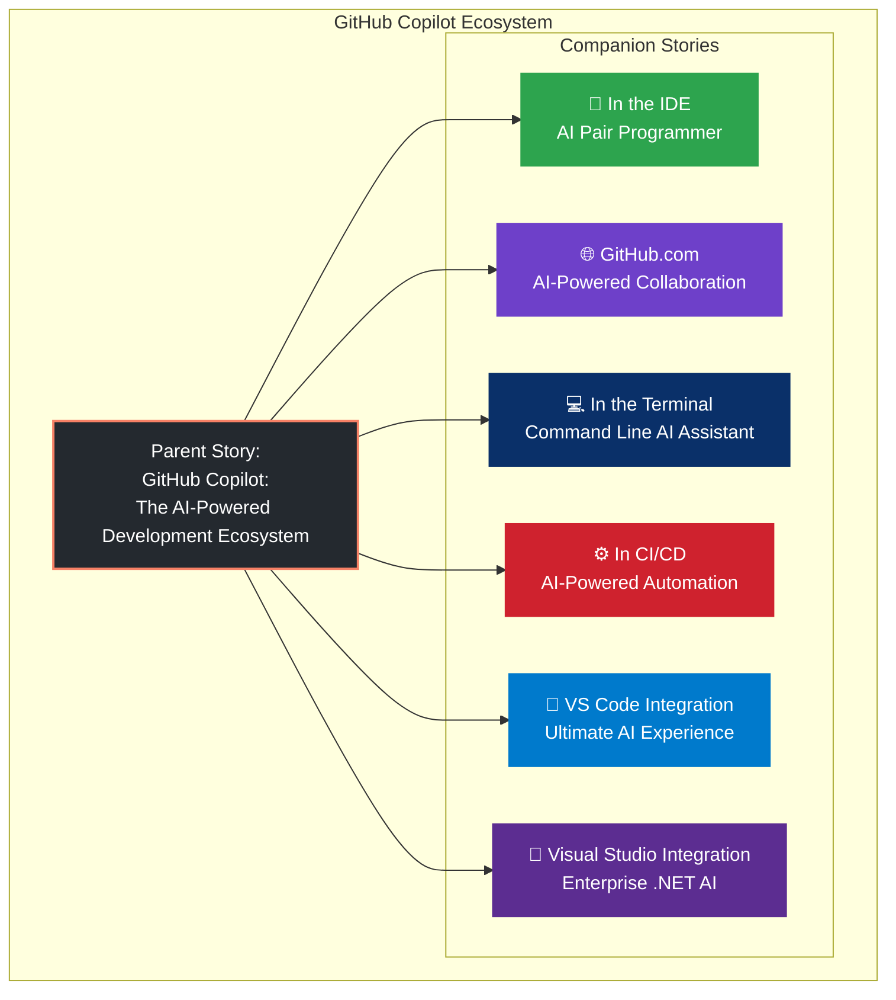

---

## VS Code: The Home of GitHub Copilot

Visual Studio Code is more than just a code editor—it's the development environment where millions of developers spend their days. With over **15 million monthly active users**, VS Code has become the most popular code editor in the world. And GitHub Copilot was born here.

The integration between GitHub Copilot and VS Code is the deepest, most feature-rich implementation of AI-assisted development available. From inline suggestions to Copilot Chat, from Workspace Commands to smart actions, VS Code is where Copilot truly shines.

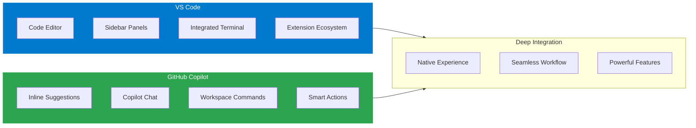

---

## Why VS Code Is the Perfect Copilot Home

VS Code's architecture makes it the ideal platform for AI-powered development:

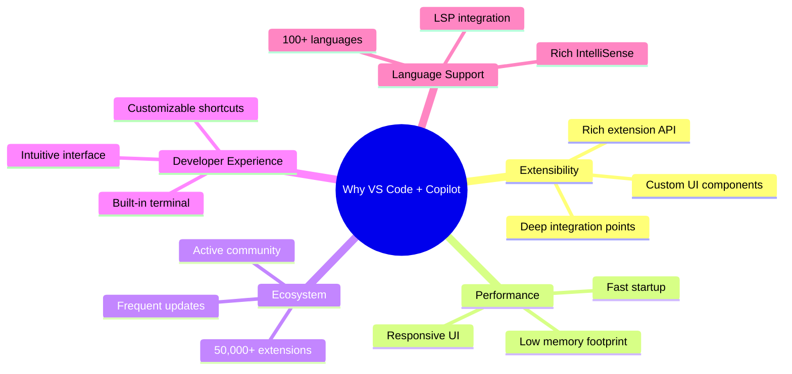

---

## 1. Getting Started: Installing GitHub Copilot in VS Code

### Installation Steps

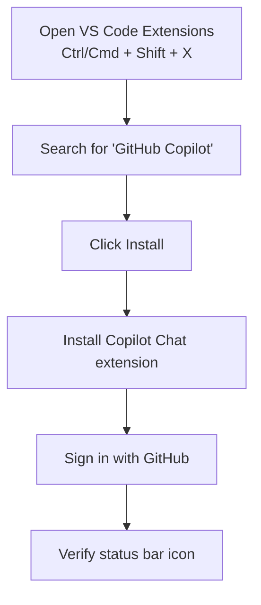

**Step-by-Step:**

1. **Open Extensions View** – Press `Ctrl/Cmd + Shift + X` or click the Extensions icon in the sidebar
2. **Search** – Type "GitHub Copilot"
3. **Install** – Click "Install" on the GitHub Copilot extension
4. **Install Copilot Chat** – Also install the GitHub Copilot Chat extension
5. **Sign In** – Follow the prompts to authenticate with your GitHub account
6. **Verify** – Check the status bar for the Copilot icon (✓ icon)

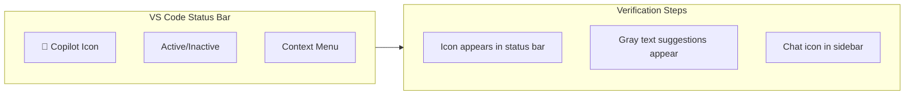

---

## 2. Inline Suggestions – The Core Experience

The most familiar Copilot feature is inline code suggestions that appear as you type.

### How It Works

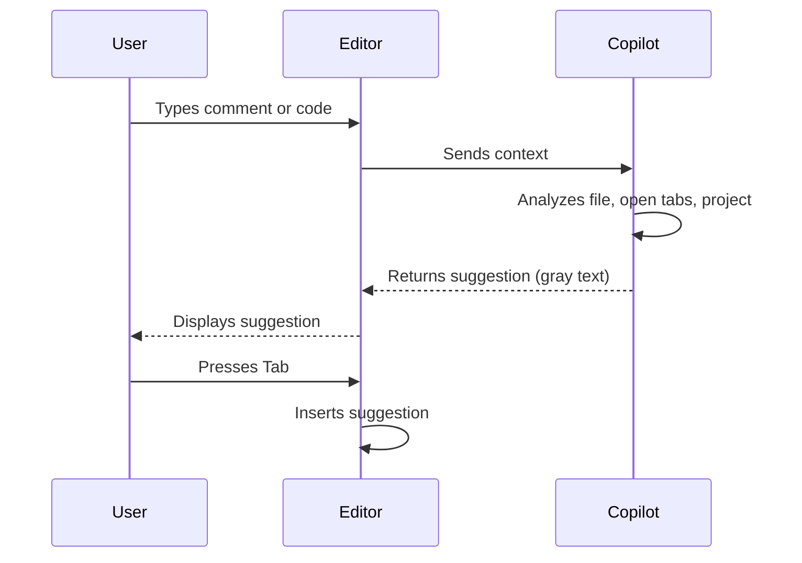

### Example in Action

```javascript
// Type a comment describing what you want
// Create a function that validates email addresses
// ↓ Copilot suggests:
function validateEmail(email) {
    const regex = /^[^\s@]+@[^\s@]+\.[^\s@]+$/;
    return regex.test(email);
}
```

### Keyboard Shortcuts

| Action | Shortcut |
|--------|----------|
| Accept suggestion | `Tab` |
| Next suggestion | `Alt/Option + ]` |
| Previous suggestion | `Alt/Option + [` |
| Trigger suggestion manually | `Ctrl/Cmd + Enter` |
| Open 10 suggestions panel | `Ctrl/Cmd + Enter` (twice) |

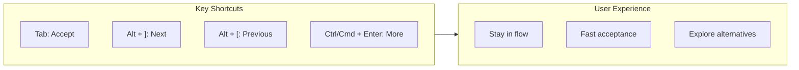

---

## 3. Copilot Chat – Conversational AI in Your Editor

Copilot Chat is the most powerful AI assistant ever integrated into VS Code, available as a sidebar panel and inline.

### Chat Interface Overview

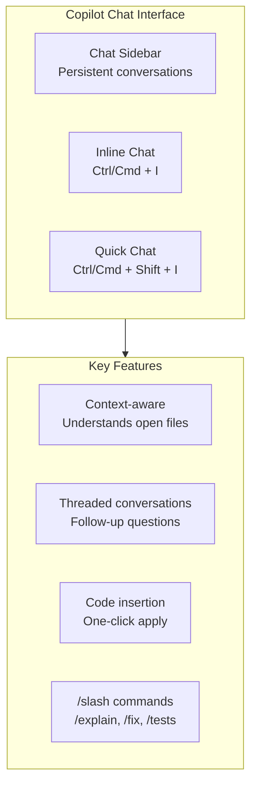

### Opening Copilot Chat

```bash
# Methods to open Copilot Chat:
1. Click the Copilot icon in the sidebar (💬)
2. Press Ctrl/Cmd + Shift + I for Quick Chat
3. Highlight code and press Ctrl/Cmd + I for Inline Chat
4. Type / in any chat input to see commands
```

### Chat Examples

**Example 1: Explaining Code**
```
User: [Highlight function] /explain: What does this do?

Copilot: This function implements a debounce pattern:
- Delays execution of the callback until after wait milliseconds
- Prevents multiple rapid calls from executing
- Returns a debounced version of the input function
- Useful for search inputs, resize handlers, and scroll events
```

**Example 2: Generating Code**
```
User: /generate: Create a React hook for local storage with type safety

Copilot: [Generates complete useLocalStorage hook with TypeScript]
```

**Example 3: Fixing Errors**
```
User: This code is throwing "Cannot read property 'map' of undefined"

Copilot: The error occurs because data might be undefined. Add a conditional check:
{data && data.map(item => ...)} or initialize data as empty array: useState([])
```

### Slash Commands in Chat

```mermaid
flowchart LR
    subgraph SlashCommands["Slash Commands"]
        Expl["/explain - Understand code"]
        Fix["/fix - Debug issues"]
        Test["/tests - Generate tests"]
        Docs["/docs - Add documentation"]
        Opt["/optimize - Improve performance"]
        Gen["/generate - Create new code"]
        Review["/review - Code review"]
    end
    
    subgraph Usage["How to Use"]
        Type["Type / in chat"]
        Select["Choose command"]
        Describe["Add description"]
        Execute["Get result"]
    end
    
    SlashCommands --> Usage
```

---

## 4. Inline Chat – Coding Without Context Switching

Inline Chat allows you to interact with Copilot without leaving your current cursor position.

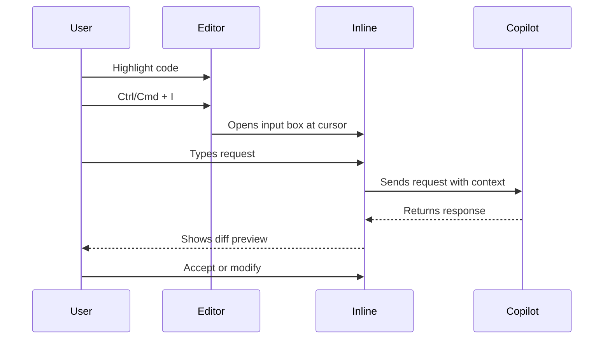

### Inline Chat Examples

**Refactoring:**
```
User: [Highlight function] Convert this to async/await
Copilot: [Shows diff with async/await version]
```

**Adding Comments:**
```
User: [Highlight complex regex] Add comment explaining this
Copilot: [Adds detailed comment line by line]
```

**Generating Tests:**
```
User: [Highlight function] Generate unit tests
Copilot: [Creates test file with multiple test cases]
```

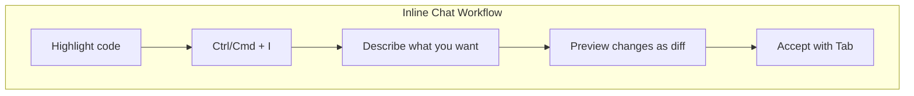

---

## 5. Workspace Commands – Multi-File Operations

VS Code is where Workspace Commands feel most powerful, allowing you to operate across your entire project.

### Accessing Workspace Commands

```bash
# Methods to trigger Workspace Commands:
1. Open Command Palette (Ctrl/Cmd + Shift + P) → "Copilot: Workspace Command"
2. Use / command in Copilot Chat
3. Right-click in Explorer → "Copilot: Refactor"
```

### Available Commands

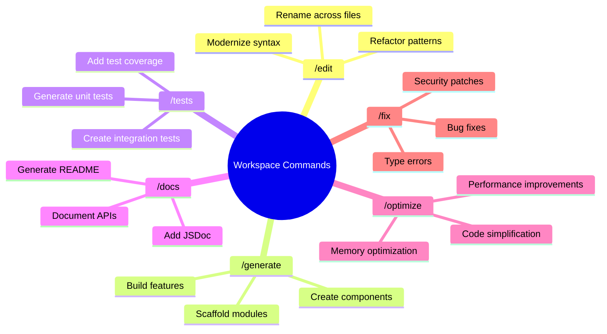

### Real Example: Cross-File Refactoring

**Command:**
```
/edit: Rename all instances of 'UserService' to 'AccountService' across the entire project
```

**Result:**
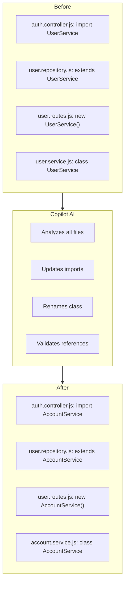

---

## 6. Smart Actions – One-Click Productivity

Smart Actions are context-aware buttons and commands that appear when Copilot detects an opportunity to help.

### Available Smart Actions

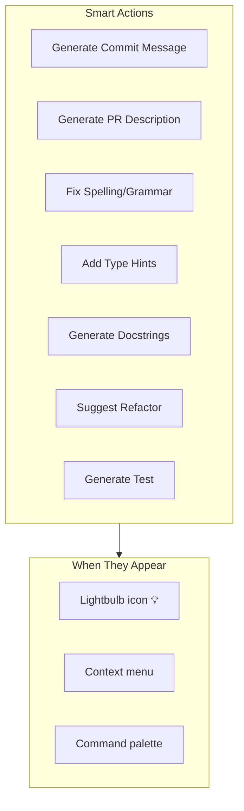

### Generate Commit Message


**Example:**
```bash
# After staging changes, a lightbulb appears
Click lightbulb → "Generate Commit Message"

Output:
feat(auth): add password reset functionality

- Add forgot password endpoint
- Create password reset token model
- Integrate email service for reset links
- Add rate limiting for reset requests
- Write tests for reset flow
```

### Fix Spelling/Grammar

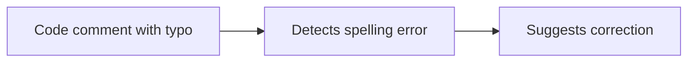

**Example:**
```javascript
// Original comment
// Validte user input before processing

// Copilot suggests:
// Validate user input before processing
```

---

## 7. Code Review in the Editor

VS Code's Copilot integration includes real-time code review as you type.

### Review Features

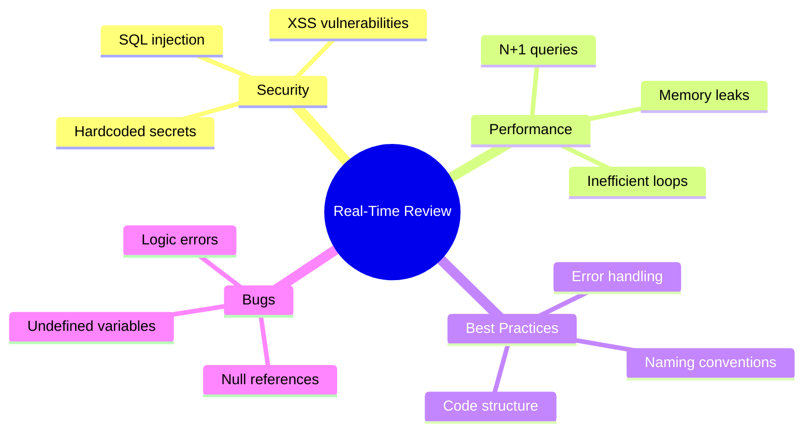

### How It Works

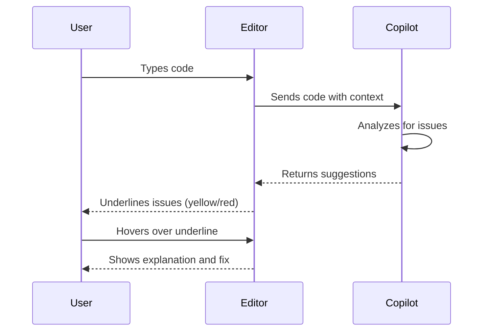

**Example:**
```javascript
// Copilot detects potential issue
const query = `SELECT * FROM users WHERE id = ${userId}`;
// Yellow underline: "Potential SQL injection vulnerability"
// Hover: "Use parameterized query to prevent SQL injection"

// Suggestion:
const query = 'SELECT * FROM users WHERE id = ?';
db.query(query, [userId]);
```

---

## 8. Terminal Integration

VS Code's integrated terminal works seamlessly with Copilot CLI.

### Terminal Commands

```bash
# In VS Code terminal, use Copilot CLI
$ gh copilot suggest "find all test files"

Suggested command:
find . -name "*.test.js" -o -name "*.spec.js"

# Or use inline
$ gh copilot explain "git rebase -i HEAD~5"
```

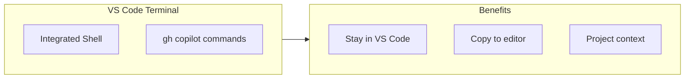

---

## 9. Multi-File Context Understanding

VS Code's Copilot understands your entire workspace, not just the current file.

### Context Awareness

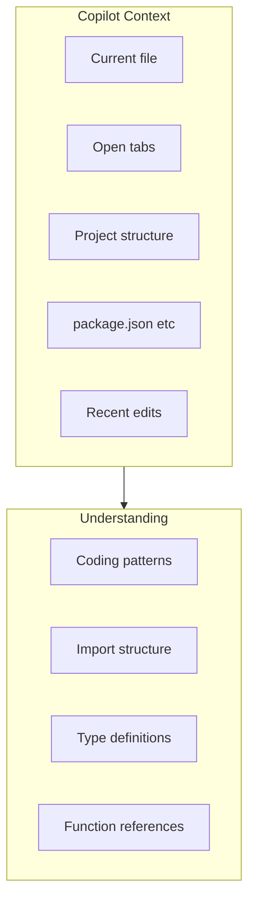

**Example:**
```javascript
// In user.controller.js
// Copilot knows about user.model.js, auth.service.js, and routes
// When you type:
// Get user by ID with their posts

// Copilot suggests:
async function getUserWithPosts(userId) {
    const user = await User.findById(userId);
    const posts = await Post.find({ author: userId });
    return { ...user.toJSON(), posts };
}
// It knows the User and Post models from your project
```

---

## 10. VS Code Settings and Customization

Customize Copilot to match your workflow.

### Settings Overview

```mermaid
graph TD
    subgraph Settings["Copilot Settings"]
        Enable[Enable/Disable Copilot]
        Languages[Language-specific settings]
        Suggestions[Suggestion behavior]
        Shortcuts[Keyboard shortcuts]
    end
    
    subgraph Customization["Customization Options"]
        Delay[Suggestion delay]
        Max[Max suggestions]
        Context[Context lines]
        Patterns[Pattern matching]
    end
    
    Settings --> Customization
```

### Key Settings

```json
{
  // Enable/disable Copilot
  "github.copilot.enable": true,
  
  // Language-specific settings
  "github.copilot.enable": {
    "*": true,
    "markdown": false,
    "plaintext": false
  },
  
  // Suggestion settings
  "github.copilot.editor.enableAutoCompletions": true,
  "github.copilot.edener.enableAutoCompletions": true,
  
  // Chat settings
  "github.copilot.chat.askQuestionTrigger": "line",
  "github.copilot.chat.codeBlock.actions": ["insert", "copy", "explain"]
}
```

### Keyboard Shortcuts Customization

```json
// keybindings.json
[
  {
    "key": "ctrl+shift+space",
    "command": "github.copilot.generate",
    "when": "editorTextFocus && github.copilot.activated"
  },
  {
    "key": "ctrl+shift+c",
    "command": "github.copilot.chat.open",
    "when": "github.copilot.chat.available"
  }
]
```

---

## 11. Extension Ecosystem Integration

Copilot works seamlessly with other VS Code extensions.

### Compatible Extensions

```mermaid
graph TD
    subgraph Extensions["Popular Extensions"]
        ESLint[ESLint]
        Prettier[Prettier]
        GitLens[GitLens]
        Docker[Docker]
        LiveShare[Live Share]
        RemoteSSH[Remote - SSH]
    end
    
    subgraph Integration["Integration Benefits"]
        Style[Follows formatting rules]
        Lint[Respects linting]
        Git[Git context]
        Remote[Works over SSH]
    end
    
    Extensions --> Integration
```

**Example with ESLint:**
```javascript
// Copilot respects your ESLint rules
// If you have rule: "quotes": ["error", "single"]
// Copilot will suggest single quotes, not double
const message = 'Hello World'; // ✓ suggested
const message = "Hello World"; // ✗ not suggested
```

---

## 12. Remote Development Support

VS Code's remote development features work perfectly with Copilot.

### Remote Scenarios

```mermaid
flowchart LR
    subgraph Remote["Remote Development"]
        WSL[Windows Subsystem for Linux]
        SSH[Remote - SSH]
        Containers[Dev Containers]
        Codespaces[GitHub Codespaces]
    end
    
    subgraph Copilot["Copilot Support"]
        Full[Full functionality]
        Same[Same experience]
        Cloud[Cloud-powered]
    end
    
    Remote --> Copilot
```

**In GitHub Codespaces:**
```bash
# Copilot is pre-installed and configured
# Same experience as local VS Code
# All features work: suggestions, chat, workspace commands
```

---

## 13. Hands-On Tutorial: Building a Feature with Copilot

Let's walk through building a complete feature using all of Copilot's VS Code capabilities.

### Scenario: Create a User Dashboard with Analytics

```mermaid
flowchart TD
    subgraph Phase1["Phase 1: Planning"]
        P1["Use /plan to break down tasks"]
        P2["Create implementation roadmap"]
    end
    
    subgraph Phase2["Phase 2: Generation"]
        G1["/generate: Create dashboard component"]
        G2["/generate: Add analytics charts"]
        G3["/generate: Create API endpoints"]
    end
    
    subgraph Phase3["Phase 3: Testing"]
        T1["/tests: Generate unit tests"]
        T2["/tests: Generate integration tests"]
    end
    
    subgraph Phase4["Phase 4: Documentation"]
        D1["/docs: Document the API"]
        D2["/docs: Add JSDoc comments"]
    end
    
    Phase1 --> Phase2 --> Phase3 --> Phase4
```

### Step 1: Plan the Feature

```javascript
// In Copilot Chat, type:
/plan: Create a user dashboard with analytics showing login activity, 
feature usage, and performance metrics

// Copilot generates:
Implementation Plan:
1. Create Dashboard component with layout structure
2. Add API endpoints for analytics data
3. Implement login activity chart using Chart.js
4. Implement feature usage bar chart
5. Add performance metrics cards
6. Create data fetching hooks
7. Add loading and error states
8. Write unit tests for components
9. Write integration tests for API
10. Add documentation
```

### Step 2: Generate the Dashboard Component

```javascript
// Inline chat (Ctrl/Cmd + I) with empty file
/generate: React dashboard component with analytics charts using Chart.js

// Copilot generates:
import React, { useState, useEffect } from 'react';
import { Line, Bar } from 'react-chartjs-2';
import {
  Chart as ChartJS,
  CategoryScale,
  LinearScale,
  PointElement,
  LineElement,
  BarElement,
  Title,
  Tooltip,
  Legend,
} from 'chart.js';

ChartJS.register(
  CategoryScale,
  LinearScale,
  PointElement,
  LineElement,
  BarElement,
  Title,
  Tooltip,
  Legend
);

const UserDashboard = () => {
  const [loginData, setLoginData] = useState(null);
  const [featureData, setFeatureData] = useState(null);
  const [metrics, setMetrics] = useState(null);
  const [loading, setLoading] = useState(true);
  const [error, setError] = useState(null);

  useEffect(() => {
    fetchDashboardData();
  }, []);

  const fetchDashboardData = async () => {
    try {
      setLoading(true);
      const [logins, features, perfMetrics] = await Promise.all([
        fetch('/api/analytics/logins').then(res => res.json()),
        fetch('/api/analytics/features').then(res => res.json()),
        fetch('/api/analytics/metrics').then(res => res.json()),
      ]);
      setLoginData(logins);
      setFeatureData(features);
      setMetrics(perfMetrics);
    } catch (err) {
      setError(err.message);
    } finally {
      setLoading(false);
    }
  };

  if (loading) return <div>Loading dashboard...</div>;
  if (error) return <div>Error: {error}</div>;

  const loginChartData = {
    labels: loginData?.dates || [],
    datasets: [
      {
        label: 'Daily Logins',
        data: loginData?.counts || [],
        borderColor: 'rgb(75, 192, 192)',
        tension: 0.1,
      },
    ],
  };

  const featureChartData = {
    labels: featureData?.features || [],
    datasets: [
      {
        label: 'Usage Count',
        data: featureData?.usage || [],
        backgroundColor: 'rgba(54, 162, 235, 0.5)',
      },
    ],
  };

  return (
    <div className="dashboard">
      <h1>User Analytics Dashboard</h1>
      
      <div className="metrics-grid">
        <div className="metric-card">
          <h3>Total Users</h3>
          <p>{metrics?.totalUsers}</p>
        </div>
        <div className="metric-card">
          <h3>Active Today</h3>
          <p>{metrics?.activeToday}</p>
        </div>
        <div className="metric-card">
          <h3>Avg Session</h3>
          <p>{metrics?.avgSessionTime} min</p>
        </div>
        <div className="metric-card">
          <h3>Retention</h3>
          <p>{metrics?.retention}%</p>
        </div>
      </div>
      
      <div className="chart-container">
        <h2>Login Activity</h2>
        <Line data={loginChartData} />
      </div>
      
      <div className="chart-container">
        <h2>Feature Usage</h2>
        <Bar data={featureChartData} />
      </div>
    </div>
  );
};

export default UserDashboard;
```

### Step 3: Generate Tests

```javascript
// In chat, with dashboard file open:
/tests: Generate comprehensive tests for the UserDashboard component

// Copilot generates:
import { render, screen, waitFor } from '@testing-library/react';
import userEvent from '@testing-library/user-event';
import UserDashboard from './UserDashboard';

// Mock fetch
global.fetch = jest.fn();

describe('UserDashboard', () => {
  beforeEach(() => {
    jest.resetAllMocks();
  });

  test('displays loading state initially', () => {
    render(<UserDashboard />);
    expect(screen.getByText(/loading dashboard/i)).toBeInTheDocument();
  });

  test('displays error state on fetch failure', async () => {
    fetch.mockRejectedValueOnce(new Error('Network error'));
    render(<UserDashboard />);
    
    await waitFor(() => {
      expect(screen.getByText(/error/i)).toBeInTheDocument();
    });
  });

  test('displays dashboard data on successful fetch', async () => {
    const mockLogins = { dates: ['Jan', 'Feb'], counts: [100, 150] };
    const mockFeatures = { features: ['Login', 'Search'], usage: [500, 300] };
    const mockMetrics = { totalUsers: 1000, activeToday: 200, avgSessionTime: 15, retention: 85 };
    
    fetch.mockImplementation((url) => {
      if (url.includes('/logins')) return Promise.resolve({ json: () => mockLogins });
      if (url.includes('/features')) return Promise.resolve({ json: () => mockFeatures });
      if (url.includes('/metrics')) return Promise.resolve({ json: () => mockMetrics });
    });
    
    render(<UserDashboard />);
    
    await waitFor(() => {
      expect(screen.getByText('User Analytics Dashboard')).toBeInTheDocument();
      expect(screen.getByText('1000')).toBeInTheDocument(); // total users
      expect(screen.getByText('200')).toBeInTheDocument(); // active today
      expect(screen.getByText('15 min')).toBeInTheDocument(); // avg session
      expect(screen.getByText('85%')).toBeInTheDocument(); // retention
    });
  });
});
```

### Step 4: Add Documentation

```javascript
// In chat:
/docs: Add JSDoc documentation to the UserDashboard component

// Copilot adds:
/**
 * UserDashboard Component
 * 
 * Displays analytics data for user activity, feature usage, and performance metrics.
 * 
 * @component
 * @returns {JSX.Element} Rendered dashboard with charts and metrics
 * 
 * @example
 * // Basic usage
 * <UserDashboard />
 * 
 * @requires Chart.js for data visualization
 * @requires fetch for API calls
 * 
 * @remarks
 * The component fetches data from three endpoints:
 * - /api/analytics/logins: Login activity over time
 * - /api/analytics/features: Feature usage statistics
 * - /api/analytics/metrics: Performance metrics
 * 
 * All API calls are made in parallel for optimal performance.
 * Loading and error states are handled automatically.
 */
```

### Step 5: Optimize Performance

```javascript
// In chat, with dashboard file open:
/optimize: Add memoization and improve performance

// Copilot suggests and applies:
import React, { useState, useEffect, useMemo, useCallback } from 'react';

// Memoize chart data to prevent unnecessary re-renders
const loginChartData = useMemo(() => ({
  labels: loginData?.dates || [],
  datasets: [{
    label: 'Daily Logins',
    data: loginData?.counts || [],
    borderColor: 'rgb(75, 192, 192)',
    tension: 0.1,
  }],
}), [loginData]);

// Memoize fetch function
const fetchDashboardData = useCallback(async () => {
  try {
    setLoading(true);
    const [logins, features, perfMetrics] = await Promise.all([
      fetch('/api/analytics/logins').then(res => res.json()),
      fetch('/api/analytics/features').then(res => res.json()),
      fetch('/api/analytics/metrics').then(res => res.json()),
    ]);
    setLoginData(logins);
    setFeatureData(features);
    setMetrics(perfMetrics);
  } catch (err) {
    setError(err.message);
  } finally {
    setLoading(false);
  }
}, []);
```

---

## 14. VS Code Copilot Tips and Tricks

### Productivity Boosters

```mermaid
mindmap
  root((VS Code + Copilot Tips))
    Navigation
      Go to definition with AI
      Find references across files
      Smart rename with /edit
    Debugging
      AI-suggested breakpoints
      Variable analysis
      Error explanation
    Refactoring
      Extract function with AI
      Rename across project
      Convert to TypeScript
    Code Quality
      AI code review
      Security scanning
      Performance suggestions
```

### Quick Reference Card

| Task | Action |
|------|--------|
| Accept suggestion | `Tab` |
| Show more suggestions | `Ctrl/Cmd + Enter` |
| Open Copilot Chat | `Ctrl/Cmd + Shift + I` |
| Inline Chat | `Ctrl/Cmd + I` |
| Workspace Command | `Ctrl/Cmd + Shift + P` → "Copilot: Workspace Command" |
| Generate commit message | Click lightbulb on staged changes |
| Explain code | Highlight → Chat → `/explain` |
| Generate tests | Highlight → Chat → `/tests` |

---

## 15. Troubleshooting VS Code Copilot

### Common Issues and Solutions

```mermaid
flowchart TD
    Problem[Problem Detected]
    
    Problem --> P1{Copilot not suggesting?}
    P1 -->|Check| S1[Verify signed in]
    P1 -->|Check| S2[Check subscription]
    P1 -->|Check| S3[Enable in settings]
    P1 -->|Check| S4[Restart VS Code]
    
    Problem --> P2{Slow suggestions?}
    P2 -->|Fix| F1[Close unused files]
    P2 -->|Fix| F2[Check internet]
    P2 -->|Fix| F3[Update VS Code]
    
    Problem --> P3{Chat not responding?}
    P3 -->|Fix| F4[Reinstall Copilot Chat]
    P3 -->|Fix| F5[Check proxy settings]
```

### Status Bar Indicators

```mermaid
graph LR
    subgraph Icons["Status Bar Icons"]
        Green[🤖 Copilot Active]
        Gray[🤖 Copilot Inactive]
        Spinner[⟳ Loading/Thinking]
        Error[⚠️ Error/Needs Auth]
    end
    
    subgraph Actions["Click Actions"]
        Enable[Enable/Disable]
        SignIn[Sign In]
        Settings[Open Settings]
    end
    
    Icons --> Actions
```

---

## What's New in VS Code Copilot (2025-2026)

```mermaid
timeline
    title VS Code Copilot Updates
    2025 : Enhanced context window (128K tokens)
         : 50% faster suggestions
    2025 : Voice commands experimental
         : Custom instructions support
    2026 : Offline mode (basic)
         : Multi-file refactoring v2
         : Enhanced language support
```

### Latest Features

- **Faster suggestions** – 50% reduced latency
- **Larger context** – 128K token window for better understanding
- **Voice commands** – Speak to Copilot (experimental)
- **Custom instructions** – `.github/copilot-instructions.md` for project-specific rules
- **Offline mode** – Basic completions without internet
- **Enhanced Workspace Commands** – Better cross-file awareness
- **Improved multi-root support** – Work across multiple projects

### Coming Soon

- **Copilot Agents** – Autonomous AI that can complete multi-step tasks
- **Real-time collaboration** – Multiple developers with shared AI context
- **Predictive completions** – AI suggests next steps before you ask
- **Enhanced debugging** – AI that can step through code and identify root causes

---

## Conclusion

GitHub Copilot in VS Code represents the most advanced AI-assisted development experience available today. With deep integration, intelligent suggestions, conversational AI, and powerful workspace commands, Copilot transforms VS Code from a code editor into an AI-powered development environment.

Whether you're:
- **Writing new features** – Inline suggestions generate code from comments
- **Understanding code** – Copilot Chat explains complex logic
- **Refactoring** – Workspace commands rename and restructure across files
- **Testing** – AI generates comprehensive test suites
- **Documenting** – JSDoc and README generation
- **Reviewing** – Real-time code review catches issues early

Copilot in VS Code meets you where you code, making you faster, more confident, and more productive.

```mermaid
graph TD
    subgraph VSCode["VS Code"]
        Editor[Code Editor]
        Chat[Copilot Chat]
        Terminal[Terminal]
        Extensions[Extensions]
    end
    
    subgraph Copilot["GitHub Copilot"]
        AI[AI-Powered Development]
    end
    
    subgraph Experience["Developer Experience"]
        Flow[Stay in Flow]
        Fast[Code Faster]
        Quality[Better Quality]
        Learn[Learn New Patterns]
    end
    
    VSCode --> Copilot
    Copilot --> Experience
    
    style VSCode fill:#007acc,stroke:#007acc,stroke-width:2px,color:#fff
    style Copilot fill:#2da44e,stroke:#2da44e,stroke-width:2px,color:#fff
```

---
## Complete Story Links

- [📖 **GitHub Copilot** – The AI-Powered Development Ecosystem](#)   
- 📝 **In the IDE** – Your AI pair programmer, always by your side - Comming soon 
- 🌐 **GitHub.com** – AI-powered collaboration at scale -  - Comming soon 
- 💻 **In the Terminal** – Your command line AI assistant - - Comming soon  
- ⚙️ **In CI/CD** – AI-powered automation in your pipelines - - Comming soon  
- 📘 **VS Code Integration** – The ultimate AI-powered development experience - Comming soon  
- 🎯 **Visual Studio Integration** – Enterprise-grade AI for .NET developers - - Comming soon  

---

**Get Started with GitHub Copilot in VS Code**

```bash
# Install GitHub Copilot
1. Open VS Code
2. Press Ctrl/Cmd + Shift + X
3. Search "GitHub Copilot"
4. Click Install
5. Sign in with GitHub

# Verify installation
- Look for Copilot icon in status bar (🤖)
- Start typing a comment and see suggestions
- Open Copilot Chat with Ctrl/Cmd + Shift + I
```

Start your AI-powered development journey at [github.com/features/copilot](https://github.com/features/copilot)

---

*This story is part of the GitHub Copilot Ecosystem Series. Last updated March 2026.*

_Questions? Feedback? Comment? leave a response below. If you're implementing something similar and want to discuss architectural tradeoffs, I'm always happy to connect with fellow engineers tackling these challenges._