# GitHub Copilot in the IDE: Your AI Pair Programmer, Always by Your Side
### VS Code Copilot, JetBrains AI, Inline Code Suggestions, Copilot Chat, Real-time Code Completion, IDE AI Assistant
*Part of the GitHub Copilot Ecosystem Series*


## Introduction

This story is part of our comprehensive exploration of **GitHub Copilot: The AI-Powered Development Ecosystem**. While the parent story introduced the full ecosystem across all development surfaces, this deep dive focuses on where developers spend most of their time—the Integrated Development Environment (IDE).


**Companion stories in this series:** *[Links Below]*
- **📝 In the IDE** – Your AI pair programmer, always by your side
- **🌐 GitHub.com** – AI-powered collaboration at scale
- **💻 In the Terminal** – Your command line AI assistant
- **⚙️ In CI/CD** – AI-powered automation in your pipelines
- **📘 VS Code Integration** – The ultimate AI-powered development experience
- **🎯 Visual Studio Integration** – Enterprise-grade AI for .NET developers


Each story explores how GitHub Copilot transforms that specific surface, while the parent story ties them all together into a unified vision of AI-powered development.

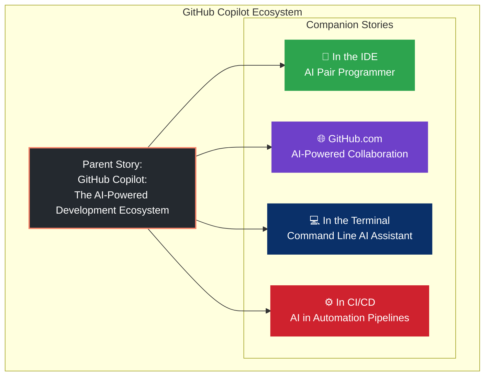

---

## The IDE: Where Code Comes to Life

For most developers, the IDE is home. It's where ideas become code, where problems get solved, and where the magic of creation happens. Whether you're in VS Code, JetBrains IntelliJ, Neovim, or Visual Studio, this is your primary workspace.

GitHub Copilot was born in the IDE. What started as an ambitious experiment in AI pair programming has evolved into a comprehensive suite of AI capabilities that feel like an extension of your own intuition.

Today, Copilot in the IDE isn't just about autocomplete—it's about having a collaborator who understands your codebase, anticipates your needs, and helps you stay in flow.

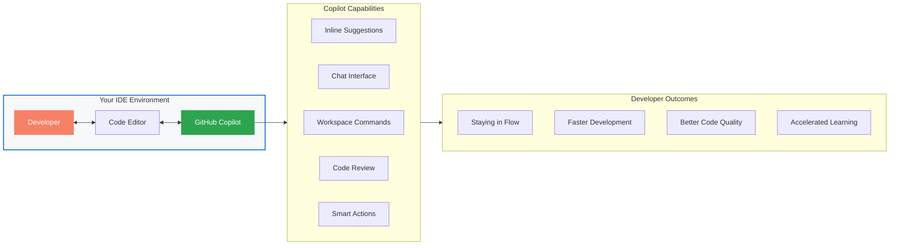

---

## The Evolution of GitHub Copilot

### From Autocomplete to AI Partner

Since its groundbreaking launch in 2021 as the world's first AI pair programmer, GitHub Copilot has fundamentally transformed how developers write code. What began as an autocomplete tool trained on billions of lines of public code has evolved into a comprehensive AI platform that spans the entire software development lifecycle.

Today, GitHub Copilot is not a single tool but an **ecosystem** of AI-powered capabilities:

- **GitHub Copilot Individual** – AI pair programmer for individual developers
- **GitHub Copilot Business** – Enterprise-grade AI with organizational controls
- **GitHub Copilot Enterprise** – Customized AI trained on your organization's codebase
- **GitHub Copilot Workspace** – AI-native development environment
- **GitHub Copilot Chat** – Natural language AI assistance in IDE
- **GitHub Copilot CLI** – AI-powered command line assistance
- **GitHub Copilot for Pull Requests** – AI-assisted code review and PR descriptions

With over **1.3 million paid subscribers** and **50,000+ organizations** using Copilot as of 2025, it has become the most widely adopted AI developer tool in history.

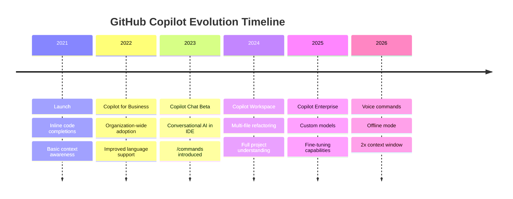

### The Evolution: From Autocomplete to AI Partner

When GitHub Copilot launched in 2021, it introduced the world to AI-powered code completion. But that was just the beginning. Today's Copilot is fundamentally different:

| Then | Now |
|------|-----|
| Single-line suggestions | Multi-file understanding |
| Generic completions | Context-aware across your entire project |
| One-way suggestions | Conversational AI (Copilot Chat) |
| Local file context | Full workspace awareness |
| Simple completions | Complex refactoring commands |

---

## What GitHub Copilot Brings to Your IDE

### Core Capabilities Overview

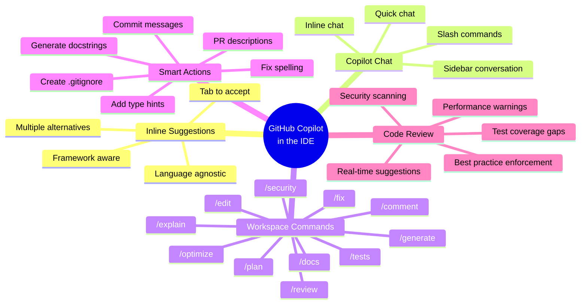

---

## 1. Inline Suggestions – The Original Superpower

The foundation of Copilot remains its uncanny ability to predict what you're going to write next. As you type, Copilot analyzes:

- Your current file and open tabs
- Your project structure and dependencies
- Your coding patterns and style
- Comments and function names
- Related files and imports

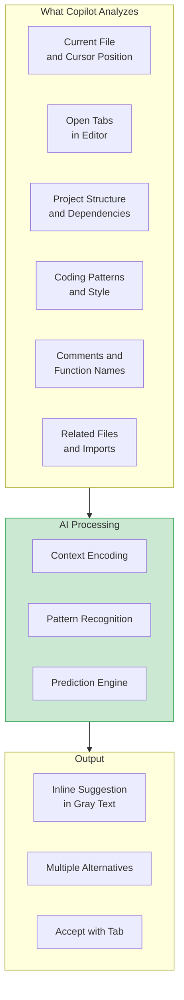

**What it looks like:**
```javascript
// As you type a comment, Copilot suggests the implementation
// Create a function that fetches user data and caches it
// ↓ Copilot suggests:
async function fetchUserWithCache(userId) {
  const cache = new Map();
  if (cache.has(userId)) return cache.get(userId);
  const user = await fetch(`/api/users/${userId}`);
  cache.set(userId, user);
  return user;
}
```

**Key features:**
- **Tab to accept** – Seamless integration with your typing flow
- **Multiple suggestions** – Use `Alt/Ctrl + [` and `]` to cycle through alternatives
- **Language agnostic** – Works with Python, JavaScript, TypeScript, Go, Rust, Java, C#, Ruby, PHP, and 20+ other languages
- **Framework aware** – Understands React, Vue, Angular, Django, Spring Boot, and more

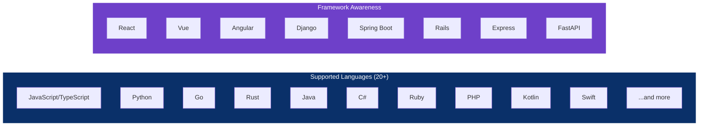

---

## 2. Copilot Chat – Conversational AI in Your Editor

Copilot Chat transforms your IDE from a code editor into an interactive development environment. Accessible via sidebar or inline, Chat lets you:

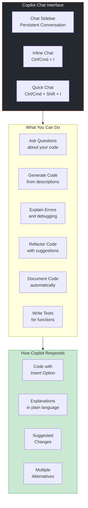

**Ask questions about your code:**
```
User: What does this authentication middleware do?
Copilot: This middleware checks for a valid JWT token in the Authorization header.
It verifies the token, extracts the user ID, and attaches the user object to the request.
If the token is missing or invalid, it returns a 401 Unauthorized response.
```

**Generate new code:**
```
User: Create a React component for a data table with sorting and filtering
Copilot: *Generates a complete component with useState, useEffect, and sorting logic*
```

**Explain errors:**
```
User: Why am I getting "Cannot read property 'map' of undefined"?
Copilot: The error indicates you're trying to call .map() on an undefined value.
This typically happens when your data hasn't loaded yet. Try adding a conditional check:
{data && data.map(item => ...)} or initialize data as an empty array.
```

**Refactor and optimize:**
```
User: Convert this class component to a functional component with hooks
Copilot: *Transforms the component, replacing setState with useState and lifecycle methods with useEffect*
```

**Chat features:**
- **Inline chat** – Highlight code and use `Ctrl/Cmd + I` to trigger inline conversations
- **Chat sidebar** – Persistent conversation with context from your entire workspace
- **Slash commands** – Use `/explain`, `/fix`, `/tests`, `/docs` directly in chat
- **Threaded conversations** – Ask follow-up questions that maintain context
- **Code insertion** – Click "Insert" to add generated code at your cursor

---

## 3. Workspace Commands – Multi-File Operations

Introduced as a core part of Copilot Workspace, these commands turn natural language into actions across your entire codebase. Unlike basic suggestions or chat, Workspace Commands understand your whole project.

### Command Reference Overview

| Command | Description |
|---------|-------------|
| `/edit` | Modify or refactor selected code |
| `/docs` | Generate or improve documentation |
| `/tests` | Create unit, integration, or end-to-end tests |
| `/explain` | Explain what a piece of code does in plain language |
| `/fix` | Identify and resolve bugs with suggested fixes |
| `/optimize` | Improve performance, readability, or structure |
| `/generate` | Create new code, files, components, or even entire modules from scratch |
| `/comment` | Add meaningful comments to clarify complex logic |
| `/plan` | Break down a feature request into implementation steps |
| `/review` | Analyze code for potential issues or improvements |
| `/security` | Identify security vulnerabilities and suggest fixes |


---

## Hands-On Examples for Each Command

### 1. `/edit` – Refactor Anything

**Prompt:**  
`/edit: Convert this function to async-await syntax.`

**Before:**
```javascript
function fetchData(url) {
  return fetch(url).then(res => res.json());
}
```

**After:**
```javascript
async function fetchData(url) {
  const res = await fetch(url);
  return res.json();
}
```

Use this to apply design patterns, rename across files, or modernize legacy code. Copilot understands your project's coding standards and follows existing patterns.

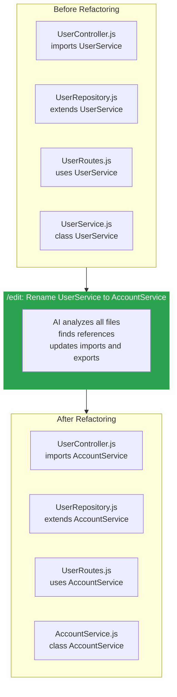

---

### 2. `/docs` – Auto-generate Documentation

**Prompt:**  
`/docs: Document this function using JSDoc.`

**Output:**
```javascript
/**
 * Fetches JSON data from the given URL.
 * @param {string} url - The API endpoint.
 * @returns {Promise<any>} The parsed JSON response.
 * @throws {Error} If the network request fails.
 */
async function fetchData(url) { ... }
```

---

### 3. `/tests` – Write Tests Automatically

**Prompt:**  
`/tests: Generate Jest tests for this function.`

**Output:**
```javascript
test('fetchData returns data from API', async () => {
  global.fetch = jest.fn(() =>
    Promise.resolve({ json: () => Promise.resolve({ name: 'Copilot' }) })
  );
  
  const result = await fetchData('https://api.example.com');
  expect(result.name).toBe('Copilot');
  expect(fetch).toHaveBeenCalledWith('https://api.example.com');
});
```

---

### 4. `/explain` – Understand Any Code

**Prompt:**  
`/explain: What does this function do?`

**Output:**  
*“This function filters an array of products to only include those with in-stock inventory and a price under $100.”*

Ideal for onboarding, reviewing PRs, or deciphering legacy logic. Copilot can explain at varying levels of detail—from high-level overview to line-by-line analysis.

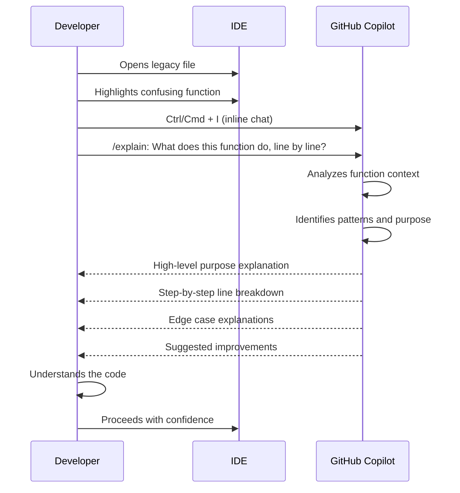

---

### 5. `/fix` – Debug Issues

**Prompt:**  
`/fix: This throws 'undefined is not a function' — fix it.`

Copilot identifies that `.map()` is being called on a non-array, suggests validation, and applies the correction with proper error handling.

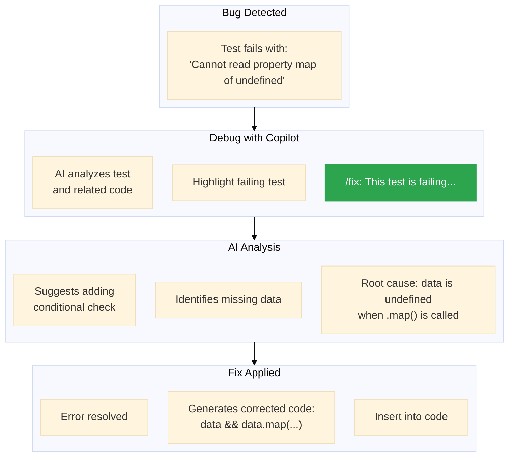

---

### 6. `/optimize` – Boost Performance

**Prompt:**  
`/optimize: Simplify this nested loop.`

**Output:**  
Optimized version using hash maps or more efficient sorting logic, often reducing time complexity from O(n²) to O(n).

---

### 7. `/generate` – Build from Scratch

**Prompt:**  
`/generate: Create a React form with validation for email and password.`

**Output:**
```jsx
import React, { useState } from 'react';

export function LoginForm({ onSubmit }) {
  const [email, setEmail] = useState('');
  const [password, setPassword] = useState('');
  const [errors, setErrors] = useState({});

  const validate = () => {
    const newErrors = {};
    if (!email.includes('@')) newErrors.email = 'Invalid email';
    if (password.length < 6) newErrors.password = 'Minimum 6 characters';
    return newErrors;
  };

  const handleSubmit = (e) => {
    e.preventDefault();
    const newErrors = validate();
    if (Object.keys(newErrors).length === 0) {
      onSubmit({ email, password });
    } else {
      setErrors(newErrors);
    }
  };

  return (
    <form onSubmit={handleSubmit}>
      <input 
        type="email" 
        value={email}
        onChange={(e) => setEmail(e.target.value)}
        required 
      />
      {errors.email && <span>{errors.email}</span>}
      <input 
        type="password" 
        value={password}
        onChange={(e) => setPassword(e.target.value)}
        minLength={6} 
        required 
      />
      {errors.password && <span>{errors.password}</span>}
      <button type="submit">Login</button>
    </form>
  );
}
```

---

### 8. `/comment` – Explain Complex Logic

**Prompt:**  
`/comment: Add a comment explaining this regex.`

**Output:**
```javascript
// This regex matches a valid email address:
// - Local part: letters, numbers, dots, underscores, percent signs, plus signs, or hyphens
// - @ symbol
// - Domain: letters, numbers, hyphens, then a dot, then 2+ letters
const emailRegex = /^[a-zA-Z0-9._%+-]+@[a-z0-9.-]+\.[a-z]{2,}$/;
```

---

### 9. `/plan` – Break Down Complex Tasks

**Prompt:**  
`/plan: Add user authentication with JWT tokens`

**Output:**
```
Implementation plan:
1. Create User model with email/password hashing
2. Build registration endpoint (/api/auth/register)
3. Build login endpoint (/api/auth/login) returning JWT
4. Create auth middleware for protected routes
5. Add JWT verification utility
6. Implement password reset flow
7. Add session management
8. Write unit tests for each endpoint
9. Update API documentation
```

---

### 10. `/security` – Find Vulnerabilities

**Prompt:**  
`/security: Check for SQL injection vulnerabilities`

**Output:**  
*“Found potential SQL injection in getUserById function. Using string concatenation with user input. Suggesting parameterized queries.”*

---

## Advanced Use Cases

### Cross-file Refactoring
`/edit: Rename all instances of 'UserService' to 'AccountService'.`  
Copilot updates imports, references, and exports across your entire codebase.

### Module Documentation
`/docs: Generate README for the 'auth' module.`  
Produces comprehensive documentation including installation, usage, API references, and examples.

### E2E Test Generation
`/tests: Generate Playwright tests for the login flow.`  
Creates complete end-to-end tests covering happy path, error cases, and edge conditions.

### SDK Generation
`/generate: Create a TypeScript SDK using our OpenAPI spec.`  
Scaffolds a fully typed SDK with proper error handling and documentation.

### Architecture Refactoring
`/optimize: Refactor this service using Clean Architecture principles.`  
Reorganizes code into entities, use cases, interfaces, and frameworks layers.

### Vulnerability Remediation
`/fix: Replace outdated cryptographic function with a secure alternative.`  
Identifies deprecated functions and replaces them with modern, secure equivalents.

### Legacy Code Modernization
`/edit: Convert this jQuery code to React.`  
Transforms legacy jQuery DOM manipulation into modern React components with state management.

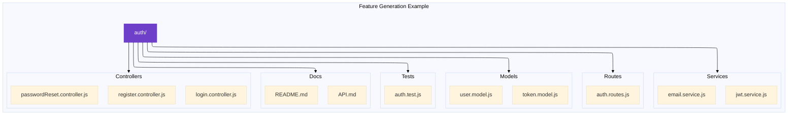

---

## 4. Smart Actions – One-Click Productivity

Copilot automates common but tedious tasks with simple commands:

- **Generate commit message** – Analyzes staged changes and writes a conventional commit message
- **Generate PR description** – Summarizes your changes for pull requests
- **Fix spelling/grammar** – Corrects comments and documentation
- **Add type hints** – Injects TypeScript types or Python type hints
- **Generate docstrings** – Creates JSDoc, Python docstrings, or JavaDoc
- **Create .gitignore** – Generates appropriate ignore files for your project
- **Initialize project** – Sets up standard project structure for your framework

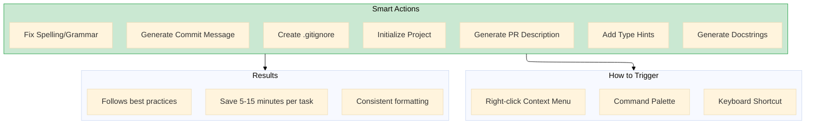

---

## 5. Code Review in the IDE

Before you even push your code, Copilot can review it:

- **Real-time suggestions** – Underlines potential issues as you type
- **Security scanning** – Identifies vulnerabilities like SQL injection or XSS
- **Performance warnings** – Highlights inefficient patterns
- **Best practice enforcement** – Suggests improvements aligned with your language's conventions
- **Test coverage gaps** – Identifies untested code paths

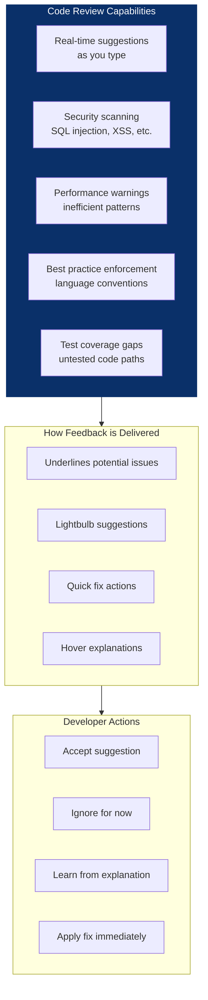

---

## IDE-Specific Deep Dives

### VS Code – The Native Experience

VS Code is where GitHub Copilot feels most at home, with deep integration that makes AI feel like a natural part of the editor.

- 🎯 **Visual Studio Integration** – Enterprise-grade AI for .NET developers - - Comming soon *coming up* 

**Key features in VS Code:**
- **Copilot Chat sidebar** – Dedicated chat panel with conversation history
- **Inline chat** – `Ctrl/Cmd + I` opens chat inline at your cursor
- **Code completions** – Gray text suggestions you can accept with Tab
- **Quick Chat** – `Ctrl/Cmd + Shift + I` for quick questions
- **Status bar integration** – See Copilot status and toggle on/off
- **Customizable shortcuts** – Configure keybindings for all Copilot actions
- **Multi-root workspace support** – Works across projects in the same window

```mermaid
flowchart LR
    subgraph VSCodeFeatures["VS Code Copilot Features"]
        Sidebar[Chat Sidebar]
        Inline[Inline Chat<br/>Ctrl/Cmd + I]
        Completions[Inline Completions<br/>Tab to accept]
        QuickChat[Quick Chat<br/>Ctrl/Cmd + Shift + I]
        Status[Status Bar Integration]
        Shortcuts[Customizable Keybindings]
        MultiRoot[Multi-root Workspace Support]
    end
    
    subgraph Benefits["Developer Benefits"]
        Seamless[Seamless integration<br/>with VS Code workflows]
        Familiar[Familiar shortcuts<br/>and UI patterns]
        Extensible[Works with<br/>other extensions]
    end
    
    VSCodeFeatures --> Benefits
    
    style VSCodeFeatures fill:#24292f,stroke:#f78166,stroke-width:1px,color:#fff
```

**Installing:**
1. Open VS Code Extensions (`Ctrl/Cmd + Shift + X`)
2. Search for "GitHub Copilot"
3. Click Install
4. Sign in with GitHub

---

### JetBrains IDEs – Deep Integration for Professional Developers

JetBrains IDEs (IntelliJ IDEA, PyCharm, WebStorm, etc.) offer a deeply integrated Copilot experience that respects JetBrains' powerful refactoring and navigation tools.

**Key features in JetBrains:**
- **Tool window** – Dedicated Copilot tool window for chat
- **Editor integration** – Inline suggestions as you type
- **Code completion integration** – Copilot suggestions appear alongside JetBrains' own completions
- **Smart selection** – Copilot understands your selection and provides context-aware suggestions
- **Project-wide context** – Leverages JetBrains' project model for better understanding

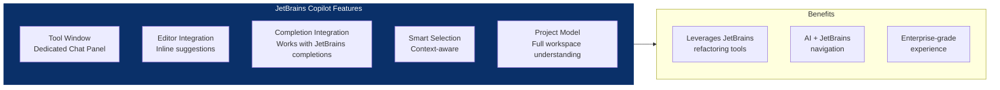

**Installing:**
1. Open Settings → Plugins
2. Search for "GitHub Copilot"
3. Install and restart
4. Sign in with GitHub

---

### Neovim – Lightweight, Terminal-First Experience

For developers who live in the terminal, Copilot for Neovim provides a lightweight but powerful experience.

**Key features in Neovim:**
- **Coc.nvim integration** – Works with the popular completion framework
- **LSP integration** – Coexists with language servers
- **Minimal overhead** – Designed for resource-conscious environments
- **Vim keybindings** – Full compatibility with modal editing
- **Remote development** – Works over SSH in remote development setups

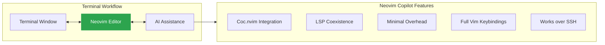

**Installing via coc.nvim:**
```vim
:CocInstall coc-copilot
```

---

### Visual Studio – Enterprise Focus

For developers working in Visual Studio (Windows), Copilot integrates with the enterprise-focused environment.

**Key features in Visual Studio:**
- **Solution-aware** – Understands complex .NET solutions
- **IntelliCode integration** – Works alongside Microsoft's IntelliCode
- **Enterprise authentication** – Supports managed identities and SSO
- **Debugger integration** – Suggestions during debugging sessions

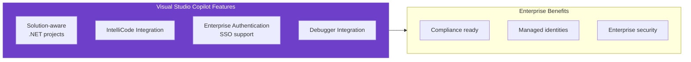

---

### Supported IDEs Overview

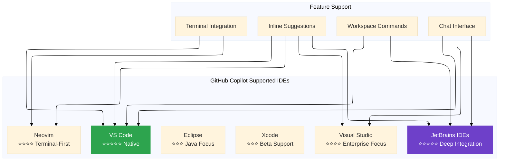

---

## Building a New Feature with Copilot

### Complete Workflow Example

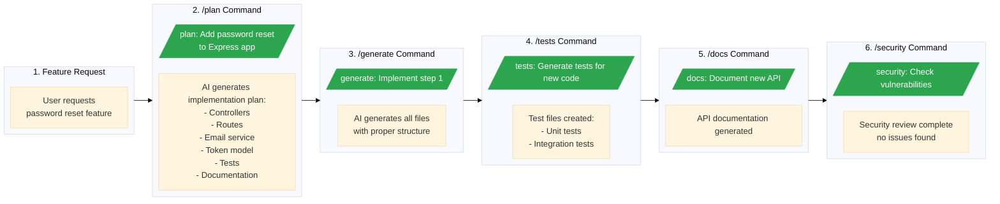

---

## Productivity Impact

### Developer Time Savings

```mermaid
---
config:
  theme: base
  layout: elk
---
gantt
    title Task Completion Time: Without vs With Copilot
    dateFormat HH:mm
    axisFormat %H:%M
    
    section Writing Boilerplate
    Without Copilot :a1, 00:00, 30m
    With Copilot    :a2, after a1, 5m
    
    section Writing Tests
    Without Copilot :b1, after a2, 45m
    With Copilot    :b2, after b1, 15m
    
    section Documentation
    Without Copilot :c1, after b2, 30m
    With Copilot    :c2, after c1, 10m
    
    section Understanding Code
    Without Copilot :d1, after c2, 25m
    With Copilot    :d2, after d1, 5m
    
    section Debugging
    Without Copilot :e1, after d2, 60m
    With Copilot    :e2, after e1, 20m
    
    section Refactoring
    Without Copilot :f1, after e2, 60m
    With Copilot    :f2, after f1, 15m
```

| Task | Without Copilot | With Copilot | Time Saved |
|------|----------------|--------------|------------|
| Writing boilerplate | 15-30 min | 2-5 min | 70-85% |
| Writing tests | 30-60 min | 5-15 min | 70-80% |
| Documentation | 20-40 min | 5-10 min | 60-75% |
| Understanding code | 15-30 min | 2-5 min | 70-85% |
| Debugging | 30-120 min | 10-30 min | 60-75% |
| Refactoring | 30-90 min | 10-20 min | 65-80% |

*Based on GitHub surveys and internal Microsoft studies*

### Developer Experience Metrics

```mermaid
---
config:
  theme: base
  layout: elk
---
pie title Developer Satisfaction with Copilot
    "Feel more productive (75%)" : 75
    "Stay in flow longer (85%)" : 85
    "Less frustration with repetitive tasks (70%)" : 70
    "Complete tasks faster (88%)" : 88
    "Would recommend to others (90%)" : 90
```

In surveys of developers using Copilot in the IDE:

- **85%** say they stay in flow state longer
- **75%** report feeling more productive
- **70%** say Copilot reduces frustration with repetitive tasks
- **88%** say they complete tasks faster
- **90%** would recommend Copilot to other developers

---

## Best Practices for Copilot in the IDE

### 1. Write Clear Comments

Copilot uses comments as context. Instead of:
```javascript
// fetch data
```
Try:
```javascript
// Fetch user profile data from the API and cache it for 5 minutes
```

### 2. Use Descriptive Names

Copilot understands semantic meaning:
```javascript
// Good
function calculateTotalAfterDiscount(price, discountPercentage) {}

// Less effective
function calc(price, disc) {}
```

### 3. Provide Examples in Comments

```javascript
// Example: formatDate(new Date('2024-01-01'), 'MM/DD/YYYY') -> '01/01/2024'
function formatDate(date, format) {}
```

### 4. Open Relevant Files

Copilot considers your open tabs. If you're working on authentication, keep related files open.

```mermaid
flowchart LR
    subgraph Context["Files Open in Editor"]
        Current[Current working file]
        Related1[auth.controller.js]
        Related2[auth.service.js]
        Related3[user.model.js]
        Related4[auth.test.js]
    end
    
    subgraph Copilot["Copilot Context"]
        Understanding[Better understanding<br/>of project structure]
        Accuracy[More accurate<br/>suggestions]
        Consistency[Consistent with<br/>existing patterns]
    end
    
    Context --> Copilot
    
    style Context fill:#0a3069,stroke:#0a3069,stroke-width:1px,color:#fff
```

### 5. Review Everything

Copilot is powerful but not infallible. Always review:
- Logic correctness
- Security implications
- Performance considerations
- Alignment with project patterns

### 6. Iterate with Chat

Start broad, then refine:
1. `/generate: Create a user profile component`
2. `/optimize: Add error handling and loading states`
3. `/tests: Generate tests for this component`

```mermaid
flowchart LR
    subgraph Iteration["Iterative Development with Copilot"]
        Start[Start with broad command]
        Generate[/generate: Create component/]
        Refine[/optimize: Add error handling/]
        Test[/tests: Generate tests/]
        Doc[/docs: Document API/]
        Done[Production-ready code]
    end
    
    Start --> Generate --> Refine --> Test --> Doc --> Done
    
    style Generate fill:#2da44e,stroke:#2da44e,stroke-width:1px,color:#fff
    style Refine fill:#2da44e,stroke:#2da44e,stroke-width:1px,color:#fff
    style Test fill:#2da44e,stroke:#2da44e,stroke-width:1px,color:#fff
    style Doc fill:#2da44e,stroke:#2da44e,stroke-width:1px,color:#fff
```

---

## Advanced Tips and Tricks

### Custom Prompts for Better Results

**For specific frameworks:**
```
/generate: Create a React component using TypeScript with styled-components
```

**For specific patterns:**
```
/edit: Convert this function to use the repository pattern
```

**For specific quality standards:**
```
/optimize: Make this code more readable and add error handling
```

### Keyboard Shortcuts

| Action | VS Code | JetBrains |
|--------|---------|-----------|
| Accept suggestion | Tab | Tab |
| Next suggestion | Alt/Option + ] | Alt + ] |
| Previous suggestion | Alt/Option + [ | Alt + [ |
| Open Copilot Chat | Ctrl/Cmd + Shift + I | Ctrl + Shift + C |
| Inline chat | Ctrl/Cmd + I | Ctrl + Shift + I |
| Trigger suggestion | Ctrl/Cmd + Enter | Ctrl + Shift + Enter |

### Combining Commands

Chain commands for comprehensive results:

```mermaid
flowchart TD
    Plan[/plan: Add user settings page/]
    Generate[/generate: Implement step 1/]
    Tests[/tests: Generate tests for all new code/]
    Docs[/docs: Document the new settings API/]
    Optimize[/optimize: Add caching for settings data/]
    
    Plan --> Generate --> Tests --> Docs --> Optimize
    
    style Plan fill:#2da44e,stroke:#2da44e,stroke-width:2px,color:#fff
    style Generate fill:#2da44e,stroke:#2da44e,stroke-width:2px,color:#fff
    style Tests fill:#2da44e,stroke:#2da44e,stroke-width:2px,color:#fff
    style Docs fill:#2da44e,stroke:#2da44e,stroke-width:2px,color:#fff
    style Optimize fill:#2da44e,stroke:#2da44e,stroke-width:2px,color:#fff
```

---

## What's New in IDE Copilot (2025-2026)

### Latest Updates

```mermaid
timeline
    title Recent Performance Improvements
    2025 : 50% faster suggestions
         : 2x longer context window (128K tokens)
    2025 : Voice commands (experimental)
         : Custom instructions via .github/copilot-instructions.md
    2026 : Offline mode (basic completions)
         : Enhanced multi-file refactoring
         : Rust, Go, Swift, Kotlin improvements
```

- **50% faster suggestions** – Reduced latency for inline completions
- **2x longer context window** – Up to 128K tokens for better understanding
- **Voice commands** – Speak to Copilot for hands-free coding (experimental)
- **Custom instructions** – Configure Copilot's behavior via `.github/copilot-instructions.md`
- **Offline mode** – Basic completions available without internet (limited)
- **Enhanced multi-file refactoring** – Better cross-file awareness
- **Improved language support** – Rust, Go, Swift, Kotlin now on par with JavaScript

### Coming Soon

```mermaid
flowchart LR
    subgraph Roadmap["Future Roadmap"]
        Agents[Copilot Agents<br/>Autonomous multi-step tasks]
        Pair[Real-time Pair Programming<br/>Shared AI context]
        Predictive[Predictive Completions<br/>Anticipates next steps]
        EnhancedDebug[Enhanced Debugging<br/>AI step-through debugging]
    end
    
    Roadmap --> Future[Future of AI-Assisted Development]
    
    style Agents fill:#6e40c9,stroke:#6e40c9,stroke-width:1px,color:#fff
    style Pair fill:#6e40c9,stroke:#6e40c9,stroke-width:1px,color:#fff
    style Predictive fill:#6e40c9,stroke:#6e40c9,stroke-width:1px,color:#fff
    style EnhancedDebug fill:#6e40c9,stroke:#6e40c9,stroke-width:1px,color:#fff
```

---

## The Technology Behind GitHub Copilot

### Model Architecture
- **Base models** – GPT-4o class models specifically fine-tuned on code
- **Specialized variants** – Separate models optimized for different languages and tasks
- **RAG (Retrieval Augmented Generation)** – Accesses your codebase for precise context
- **Fine-tuning** – Enterprise models customized to organizational codebases

### Privacy and Security
- **No training on private code** – Your code is never used to train public models
- **Enterprise controls** – Admins control AI usage, data retention, and model selection
- **SOC2 compliant** – Enterprise-grade security certifications
- **Code scanning integration** – AI suggestions are scanned for security issues

```mermaid
graph TD
    subgraph Privacy["Privacy & Security"]
        NoTrain[No training on private code]
        Enterprise[Enterprise controls]
        SOC2[SOC2 compliant]
        CodeScan[Code scanning integration]
    end
    
    subgraph Architecture["Model Architecture"]
        GPT[GPT-4o class models]
        Specialized[Specialized variants per language]
        RAG[RAG - Codebase context]
        FineTune[Fine-tuning for Enterprise]
    end
    
    style Privacy fill:#0a3069,stroke:#0a3069,stroke-width:1px,color:#fff
    style Architecture fill:#6e40c9,stroke:#6e40c9,stroke-width:1px,color:#fff
```

---

## Measuring Impact – GitHub Copilot by the Numbers

### Developer Productivity
- **55% faster** task completion (Microsoft internal study)
- **75% of developers** feel more focused with Copilot
- **88% of users** report completing tasks faster
- **60-75% reduction** in time spent on repetitive tasks

### Code Quality
- **25-40% fewer** bugs in production (based on user surveys)
- **30% increase** in test coverage when using `/tests` commands
- **50% faster** code review cycles with AI-assisted review

### Developer Satisfaction
- **85% of developers** say Copilot helps them stay in flow state
- **70% report** reduced burnout from repetitive tasks
- **90% would recommend** Copilot to other developers

### Adoption
- **1.3 million+** paid subscribers
- **50,000+** organizations using Copilot Business or Enterprise
- **Over 1 billion** code completions accepted per month
- **100,000+** organizations using Copilot Free

```mermaid
pie title GitHub Copilot Adoption Metrics
    "Paid Subscribers (1.3M+)" : 1300000
    "Organizations (50K+)" : 50000
    "Code Completions/Month (1B+)" : 1000000000
```

---

## GitHub Copilot vs. Other AI Coding Tools

| Feature | GitHub Copilot | ChatGPT/Claude | Cursor | Amazon CodeWhisperer |
|---------|----------------|----------------|--------|---------------------|
| IDE Integration | Deep (native in VS Code, JetBrains, etc.) | Limited | Yes | Yes |
| Codebase Context | Full project understanding | Copy-paste only | Project-level | Limited |
| GitHub Integration | Native (Issues, PRs, Actions) | None | Partial | None |
| Enterprise Customization | Yes (Copilot Enterprise) | Limited | Limited | Yes |
| Pricing | Free tier, $10-39/month | Varies | $20/month | Free tier available |
| Model Options | Multiple (GPT-4o, specialized) | Single per service | Multiple | Amazon proprietary |
| Privacy Controls | Enterprise-grade | Limited | Limited | Enterprise |

---

## Troubleshooting Common Issues

### Troubleshooting Flow

```mermaid
flowchart TD
    Start[Issue: Copilot isn't suggesting code]
    
    Start --> Check1{Is internet<br/>connected?}
    Check1 -->|No| Fix1[Connect to internet<br/>and restart IDE]
    Check1 -->|Yes| Check2{Are you signed in<br/>to GitHub?}
    
    Check2 -->|No| Fix2[Sign in to GitHub<br/>in IDE settings]
    Check2 -->|Yes| Check3{Is subscription<br/>active?}
    
    Check3 -->|No| Fix3[Check subscription status<br/>at github.com/settings/billing]
    Check3 -->|Yes| Check4{Is Copilot enabled?<br/>Check status bar}
    
    Check4 -->|No| Fix4[Enable Copilot<br/>in status bar or settings]
    Check4 -->|Yes| Check5{Is the file type<br/>supported?}
    
    Check5 -->|No| Fix5[Check language support<br/>Some languages have limited features]
    Check5 -->|Yes| Check6{Try restarting<br/>IDE?}
    
    Check6 -->|Try| Fix6[Restart IDE<br/>and reopen project]
    Check6 -->|Still issue| Support[Contact GitHub Support<br/>with logs]
    
    style Start fill:#cf222e,stroke:#cf222e,stroke-width:2px,color:#fff
    style Support fill:#f78166,stroke:#f78166,stroke-width:2px,color:#fff
```

### Common Issues and Solutions

**Copilot isn't suggesting code**
- Check that you're signed in to GitHub
- Verify your subscription is active
- Ensure Copilot is enabled (check status bar)
- Try restarting your IDE

**Suggestions aren't relevant**
- Open more files in your workspace for context
- Write clearer comments
- Ensure your project structure is properly set up
- Try using `/explain` to understand what Copilot sees

**Performance is slow**
- Close unnecessary files and projects
- Check your internet connection
- Update to the latest version
- Consider disabling Copilot on very large files

---

## Conclusion

GitHub Copilot in the IDE is more than a tool—it's a fundamental shift in how developers work. It transforms the IDE from a passive code editor into an active collaboration space where you and AI build software together.

Whether you're:
- **Writing new features** – Copilot generates code from comments
- **Understanding legacy systems** – Copilot explains complex logic
- **Fixing bugs** – Copilot identifies and resolves issues
- **Writing tests** – Copilot ensures coverage
- **Documenting code** – Copilot creates documentation

Copilot meets you where you are, respects your patterns, and amplifies your capabilities.

```mermaid
---
config:
  theme: base
  layout: elk
---
graph TD
    subgraph IDE["Your IDE"]
        You[You]
        Copilot[GitHub Copilot]
        Code[Your Codebase]
    end
    
    You <--> Copilot
    Copilot <--> Code
    
    subgraph Outcomes["Outcomes"]
        Flow[Staying in Flow]
        Quality[Higher Quality Code]
        Speed[Faster Development]
        Joy[Rediscover Joy of Coding]
    end
    
    IDE --> Outcomes
    
    style Copilot fill:#2da44e,stroke:#2da44e,stroke-width:2px,color:#fff
    style You fill:#f78166,stroke:#f78166,stroke-width:2px,color:#fff
```

---

## Complete Story Links

- [📖 **GitHub Copilot** – The AI-Powered Development Ecosystem](#)   
- 📝 **In the IDE** – Your AI pair programmer, always by your side - Comming soon 
- 🌐 **GitHub.com** – AI-powered collaboration at scale -  - Comming soon 
- 💻 **In the Terminal** – Your command line AI assistant - - Comming soon  
- ⚙️ **In CI/CD** – AI-powered automation in your pipelines - - Comming soon  
- 📘 **VS Code Integration** – The ultimate AI-powered development experience - Comming soon  
- 🎯 **Visual Studio Integration** – Enterprise-grade AI for .NET developers - - Comming soon  

---

**Get Started with GitHub Copilot**
- **Free tier** – 50 completions per month for all developers
- **Copilot Individual** – $10/month for unlimited usage
- **Copilot Business** – $19/user/month with organization management
- **Copilot Enterprise** – $39/user/month with customization and advanced controls

Start your AI-powered development journey at [github.com/features/copilot](https://github.com/features/copilot)

---

*This story is part of the GitHub Copilot Ecosystem Series. Last updated March 2026.*

_Questions? Feedback? Comment? leave a response below. If you're implementing something similar and want to discuss architectural tradeoffs, I'm always happy to connect with fellow engineers tackling these challenges._