# GitHub Copilot in the Terminal: Your Command Line AI Assistant
### Copilot CLI, Natural Language to Shell Commands, Bash Script Generation, Git AI Assistant, Terminal Productivity

*Part of the GitHub Copilot Ecosystem Series*


## Introduction

This story is part of our comprehensive exploration of **GitHub Copilot: The AI-Powered Development Ecosystem**. While the parent story introduced the full ecosystem across all development surfaces, this deep dive focuses on how GitHub Copilot transforms the terminal—the command line interface where developers execute commands, manage systems, and automate workflows.

**Companion stories in this series:**
- **📝 In the IDE** – Your AI pair programmer, always by your side
- **🌐 GitHub.com** – AI-powered collaboration at scale
- **💻 In the Terminal** – Your command line AI assistant
- **⚙️ In CI/CD** – AI-powered automation in your pipelines
- **📘 VS Code Integration** – The ultimate AI-powered development experience
- **🎯 Visual Studio Integration** – Enterprise-grade AI for .NET developers


Each story explores how GitHub Copilot transforms that specific surface, while the parent story ties them all together into a unified vision of AI-powered development.

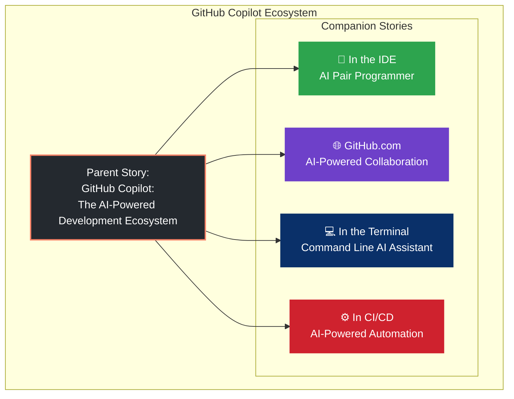

---

## The Terminal: Where Developers Command

For developers, the terminal is sacred ground. It's where we navigate file systems, run builds, manage containers, deploy applications, and automate everything. The command line is fast, powerful, and unforgiving—one wrong command can have serious consequences.

GitHub Copilot is now bringing AI to the terminal, transforming how we discover, remember, and execute commands. With **Copilot CLI**, you can describe what you want in plain English and get the exact command you need. No more memorizing obscure flags or searching Stack Overflow for syntax.

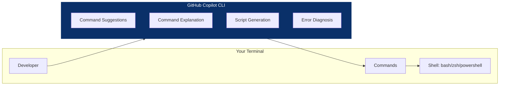

---

## The Evolution of Terminal AI

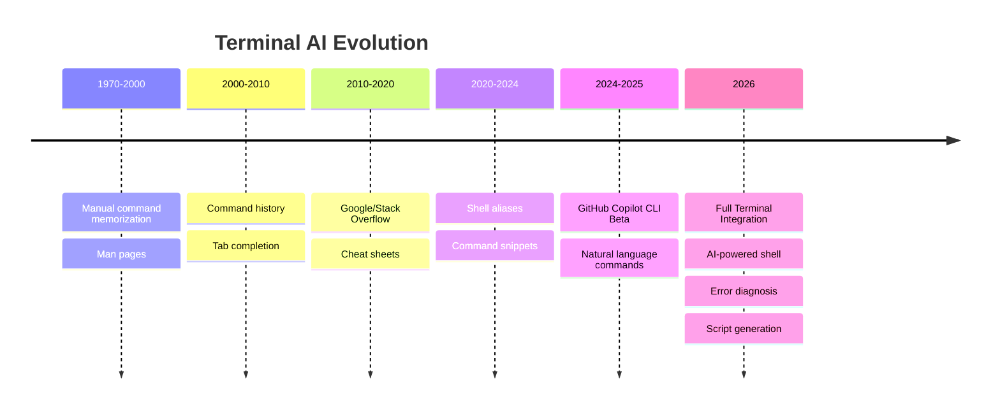

Today, GitHub Copilot CLI offers a comprehensive suite of terminal capabilities:

| Capability | Description |
|------------|-------------|
| **Command Suggestions** | Describe what you want, get the exact command |
| **Command Explanation** | Understand what a complex command does |
| **Script Generation** | Create bash, PowerShell, or Python scripts |
| **Error Diagnosis** | Explain and fix command failures |
| **Alias Generation** | Create shortcuts for frequent commands |
| **Git Assistance** | Help with complex Git operations |
| **Multi-Command Workflows** | Chain commands for complex tasks |
| **Cross-Platform Support** | Works on Linux, macOS, Windows |

---

## 1. GitHub Copilot CLI – Your AI-Powered Shell

GitHub Copilot CLI is the flagship terminal assistant. Available via the `gh copilot` command, it brings AI directly to your shell.

### Installation

```bash
# Install GitHub CLI if you haven't already
brew install gh  # macOS
sudo apt install gh  # Ubuntu/Debian
winget install --id GitHub.cli  # Windows

# Install Copilot CLI extension
gh extension install github/gh-copilot

# Authenticate
gh auth login
```

### Basic Usage

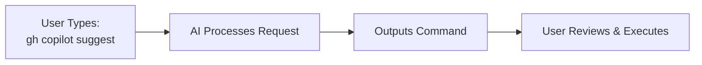

**Command Suggestion:**
```bash
$ gh copilot suggest "find all large files over 100MB in the current directory"

Suggested command:
find . -type f -size +100M

Explain this command? [y/N]
```

**Command Explanation:**
```bash
$ gh copilot explain "git rebase -i HEAD~5"

This command opens an interactive rebase for the last 5 commits.
-i: Interactive mode allows you to reorder, squash, or edit commits
HEAD~5: Specifies the last 5 commits from the current branch

Use this to:
- Combine multiple commits
- Reorder commits
- Edit commit messages
- Split commits into smaller ones
```

---

## 2. Command Suggestions – Natural Language to Shell

The core of Copilot CLI is the ability to translate natural language into shell commands:

### Basic Command Generation

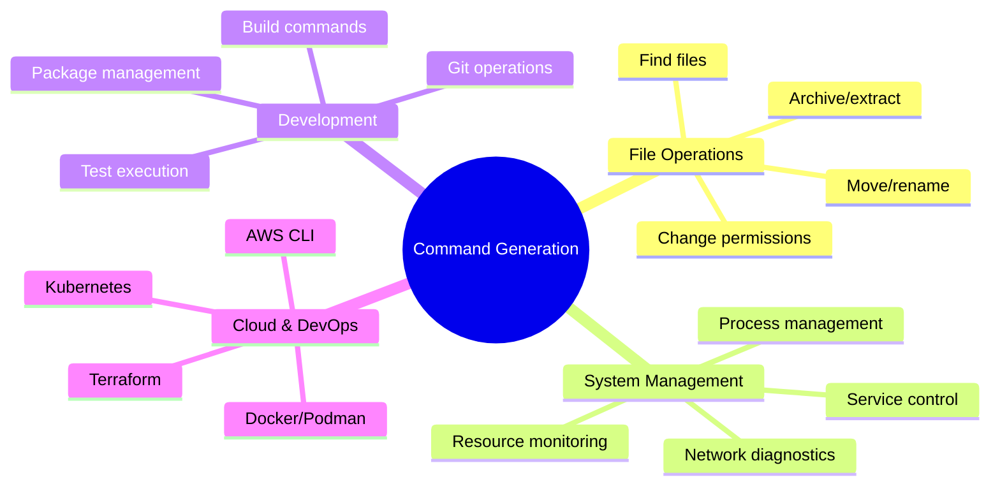

**Examples:**

| Natural Language | Generated Command |
|------------------|-------------------|
| "show all running processes" | `ps aux` |
| "find all JavaScript files in src" | `find src -name "*.js"` |
| "list all Docker containers" | `docker ps -a` |
| "show disk usage in human readable format" | `df -h` |
| "kill process on port 3000" | `lsof -ti:3000 \| xargs kill -9` |
| "zip the dist folder into release.zip" | `zip -r release.zip dist/` |
| "show last 50 lines of log file" | `tail -n 50 app.log` |
| "search for TODO in all files" | `grep -r "TODO" .` |

```bash
$ gh copilot suggest "show all Node.js processes running on my system"

Suggested command:
ps aux | grep node

Alternative commands:
1. pgrep -f node
2. top -l 1 | grep node (macOS)
3. htop (interactive)

[Accept] [Explain] [Alternative] [Cancel]
```

### Context-Aware Suggestions

Copilot CLI understands your current directory and context:

```bash
$ gh copilot suggest "run tests for this project"

# Detects package.json and suggests:
npm test

# If Jest config exists:
npm run test:unit

# If Python:
pytest
```

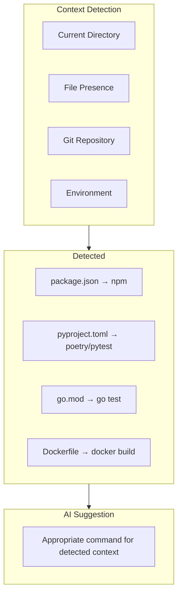

---

## 3. Command Explanation – Understanding Complex Commands

When you encounter a complex command, Copilot CLI can explain what it does:

```bash
$ gh copilot explain "find . -type f -name '*.log' -mtime +7 -exec rm {} \;"

This command finds and deletes all log files older than 7 days:

- find .           : Start searching from current directory
- -type f          : Look for files only (not directories)
- -name '*.log'    : Match files ending with .log
- -mtime +7        : Files modified more than 7 days ago
- -exec rm {} \;   : Delete each found file

Use this for log rotation and cleanup tasks.
```

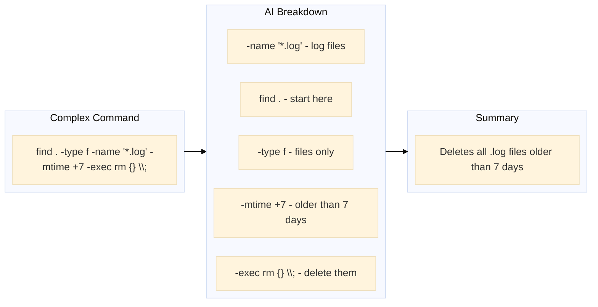

### Explaining Pipelines

```bash
$ gh copilot explain "ps aux | grep node | awk '{print $2}' | xargs kill -9"

This pipeline kills all Node.js processes:

1. ps aux              : List all running processes
2. grep node           : Filter to Node.js processes
3. awk '{print $2}'    : Extract process IDs (PID) from column 2
4. xargs kill -9       : Force kill each PID

⚠️ Warning: This forcefully terminates processes without cleanup.
Consider using kill -15 (TERM) for graceful shutdown first.
```

---

## 4. Script Generation – From Idea to Executable

Copilot CLI can generate complete shell scripts for complex automation:

### Basic Script Generation

```bash
$ gh copilot script "backup all databases to S3 with timestamp"

Generated script: backup.sh

```bash
#!/bin/bash
# Database backup script with S3 upload

set -e

# Configuration
TIMESTAMP=$(date +"%Y%m%d_%H%M%S")
BACKUP_DIR="/tmp/backups"
S3_BUCKET="s3://my-backups/databases"

# Create backup directory
mkdir -p "$BACKUP_DIR"

# Backup PostgreSQL databases
echo "Backing up databases..."
for db in $(psql -t -c "SELECT datname FROM pg_database WHERE datistemplate = false;" postgres); do
    echo "  Backing up $db..."
    pg_dump "$db" > "$BACKUP_DIR/${db}_$TIMESTAMP.sql"
done

# Compress backups
echo "Compressing backups..."
tar -czf "$BACKUP_DIR/backup_$TIMESTAMP.tar.gz" -C "$BACKUP_DIR" ./*.sql

# Upload to S3
echo "Uploading to S3..."
aws s3 cp "$BACKUP_DIR/backup_$TIMESTAMP.tar.gz" "$S3_BUCKET/backup_$TIMESTAMP.tar.gz"

# Clean up
echo "Cleaning up..."
rm -rf "$BACKUP_DIR"

echo "Backup complete: backup_$TIMESTAMP.tar.gz"
```

Save and execute with: chmod +x backup.sh && ./backup.sh

### Multi-Language Support

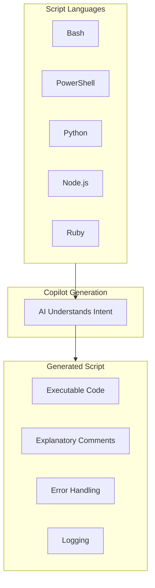

```bash
# Generate Python script
$ gh copilot script "fetch API data and save to CSV" --lang python

# Generate PowerShell script (Windows)
$ gh copilot script "restart all IIS app pools" --lang powershell

# Generate Node.js script
$ gh copilot script "watch file changes and rebuild" --lang node
```

---

## 5. Error Diagnosis – Fixing Command Failures

When a command fails, Copilot CLI can diagnose and suggest fixes:

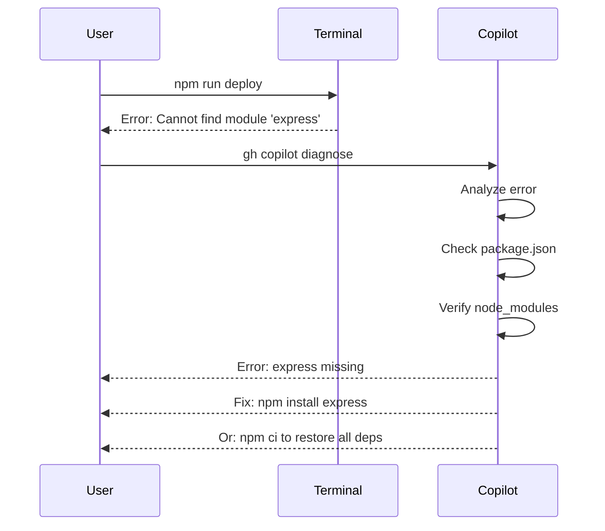

**Example:**

```bash
$ npm run build
> Error: Cannot find module 'webpack'

$ gh copilot diagnose

🔍 Diagnosis:

Error: Module 'webpack' not found

Root Cause: webpack is not installed in your project.

Suggested Fixes:

1. Install as dev dependency:
   npm install --save-dev webpack webpack-cli

2. Or install globally (not recommended for projects):
   npm install -g webpack webpack-cli

3. If you have package.json, run:
   npm install

Would you like me to run the suggested fix? [y/N]
```

### Common Error Patterns

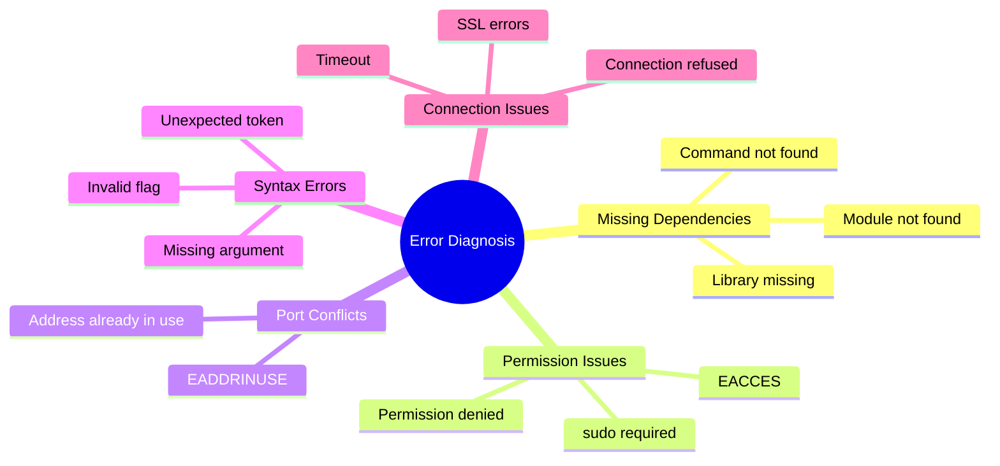

---

## 6. Git Assistance – AI-Powered Version Control

Git is one of the most complex command-line tools. Copilot CLI simplifies Git operations:

### Git Command Generation

```bash
$ gh copilot suggest "undo the last commit but keep the changes"

Suggested command:
git reset --soft HEAD~1

This will:
- Undo the last commit
- Keep changes in staging area
- Allows you to amend or recommit

Alternative:
git reset HEAD~1        # Unstage changes too
```

### Git Workflow Assistance

```bash
$ gh copilot suggest "create a new branch, commit all changes, and push"

Suggested workflow:

# Create and switch to new branch
git checkout -b feature/new-feature

# Stage all changes
git add .

# Commit with message
git commit -m "feat: add new feature"

# Push to remote
git push -u origin feature/new-feature

Execute all commands? [y/N]
```

### Resolving Merge Conflicts

```bash
$ gh copilot suggest "resolve merge conflicts in index.html"

Git status shows conflicts in index.html

To resolve conflicts in index.html:

1. Open the file and look for:
   <<<<<<< HEAD
   (your changes)
   =======
   (incoming changes)
   >>>>>>> branch

2. Edit to keep desired changes and remove markers

3. Mark as resolved:
   git add index.html

4. Continue merge:
   git commit

Or use merge tool:
git mergetool
```

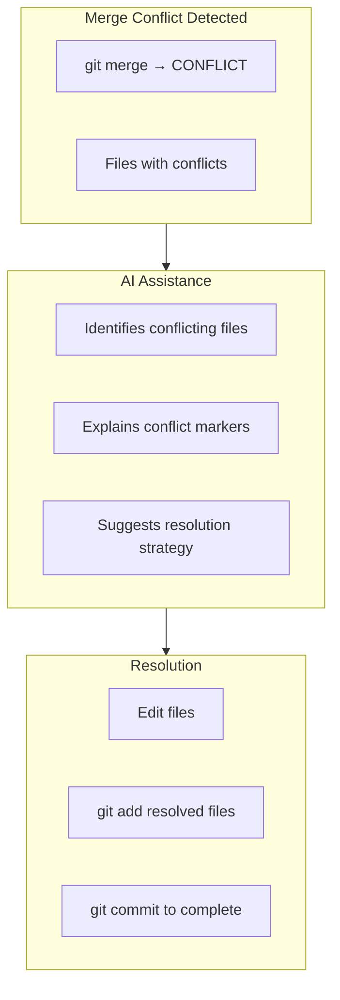

---

## 7. Alias Generation – Creating Shortcuts

Copilot CLI can generate shell aliases for frequently used commands:

```bash
$ gh copilot alias "deploy-prod" "npm run build && aws s3 sync ./build s3://my-bucket --delete"

Generated alias for your shell:

# Add to ~/.bashrc, ~/.zshrc, or ~/.bash_profile
alias deploy-prod='npm run build && aws s3 sync ./build s3://my-bucket --delete'

Would you like me to add this to your shell config? [y/N]
```

**Alias Suggestions Based on History:**

```bash
$ gh copilot analyze-history

Based on your command history, here are suggested aliases:

1. git commit -am "fix: " && git push
   → alias quick-fix='git commit -am "fix: " && git push'

2. docker-compose up -d && docker-compose logs -f
   → alias dc-up='docker-compose up -d && docker-compose logs -f'

3. npm run test:unit && npm run test:integration
   → alias test-all='npm run test:unit && npm run test:integration'

Create these aliases? [Select aliases to create]
```

---

## 8. Multi-Command Workflows – Complex Task Automation

Copilot CLI can generate and execute multi-step workflows:

```bash
$ gh copilot workflow "set up a new Node.js project with TypeScript, ESLint, and Jest"

Generated workflow:

#!/bin/bash
# Node.js + TypeScript + ESLint + Jest setup

# 1. Initialize project
mkdir my-project && cd my-project
npm init -y

# 2. Install dependencies
npm install --save-dev typescript @types/node
npm install --save-dev eslint @typescript-eslint/parser @typescript-eslint/eslint-plugin
npm install --save-dev jest @types/jest ts-jest

# 3. Configure TypeScript
npx tsc --init --rootDir src --outDir dist --strict

# 4. Configure ESLint
npx eslint --init

# 5. Configure Jest
npx ts-jest config:init

# 6. Create source directory
mkdir src

# 7. Add test script to package.json
npm pkg set scripts.test="jest"
npm pkg set scripts.build="tsc"
npm pkg set scripts.dev="tsc --watch"

echo "Project setup complete!"

Execute this workflow? [y/N]
```

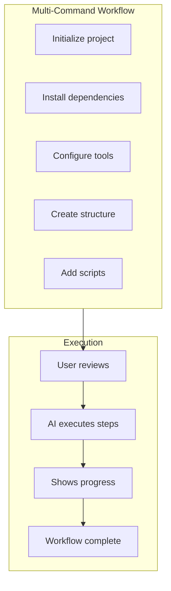

---

## 9. Docker & Container Assistance

Copilot CLI is especially helpful for Docker and container commands:

```bash
$ gh copilot suggest "build and run Docker container with port mapping"

Suggested command:
docker build -t myapp . && docker run -p 3000:3000 myapp

Breakdown:
- docker build -t myapp .   : Build image from Dockerfile
- docker run -p 3000:3000   : Map host 3000 to container 3000
- myapp                      : Use the built image
```

### Docker Compose Help

```bash
$ gh copilot suggest "start all services, rebuild if needed, and view logs"

Suggested command:
docker-compose up -d --build && docker-compose logs -f

This will:
- up -d        : Start services in detached mode
- --build      : Rebuild images before starting
- logs -f      : Follow logs from all services
```

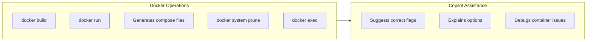

---

## 10. Kubernetes & Cloud CLI Assistance

Copilot CLI helps with Kubernetes and cloud provider commands:

### kubectl Commands

```bash
$ gh copilot suggest "show all pods in namespace production"

Suggested command:
kubectl get pods -n production

Additional options:
- kubectl get pods -n production -o wide   (more details)
- kubectl describe pods -n production       (detailed info)
```

### AWS CLI

```bash
$ gh copilot suggest "list all EC2 instances with tag Environment=Production"

Suggested command:
aws ec2 describe-instances --filters "Name=tag:Environment,Values=Production" --query "Reservations[*].Instances[*].[InstanceId,State.Name]" --output table
```

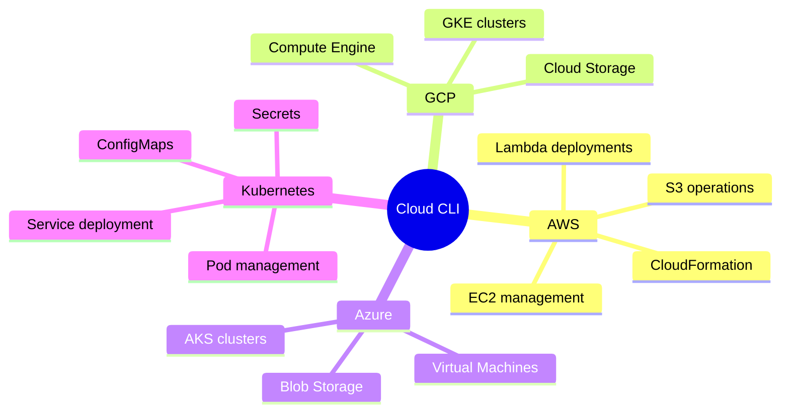

---

## 11. Cross-Platform Support

Copilot CLI works across all major shells and operating systems:

### Shell Support

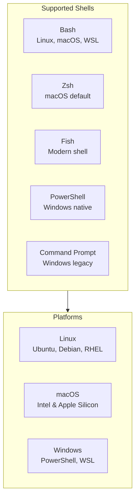

### Platform-Specific Suggestions

```bash
# Linux
$ gh copilot suggest "show systemd service status"
systemctl status

# macOS
$ gh copilot suggest "show systemd service status"
# Detects macOS → suggests:
brew services list
launchctl list

# Windows PowerShell
$ gh copilot suggest "list all running processes"
Get-Process

# WSL (Windows Subsystem for Linux)
$ gh copilot suggest "show Windows drives from WSL"
ls /mnt/c /mnt/d
```

---

## 12. Custom Configuration and Personalization

Copilot CLI can be customized to match your workflow:

### Configuration File

```yaml
# ~/.config/gh-copilot/config.yml

# Preferred shell
shell: zsh

# Default language for script generation
default_language: bash

# Safety level: 'strict', 'normal', 'relaxed'
safety_level: normal

# Always confirm dangerous commands
confirm_dangerous: true

# Show explanations automatically
auto_explain: true

# Custom aliases to ignore
ignore_aliases:
  - ls
  - cd

# Preferred command style
preferences:
  - use_long_options  # Prefer --force over -f
  - show_alternatives  # Always show alternative commands
```

### Custom Commands

```bash
# Create custom command
$ gh copilot custom "deploy-staging" "npm run build && rsync -avz dist/ user@staging:/var/www"

Custom command created: deploy-staging

Usage: gh copilot deploy-staging
```

---

## Real-World Terminal Use Cases

### Use Case 1: Onboarding New Developers

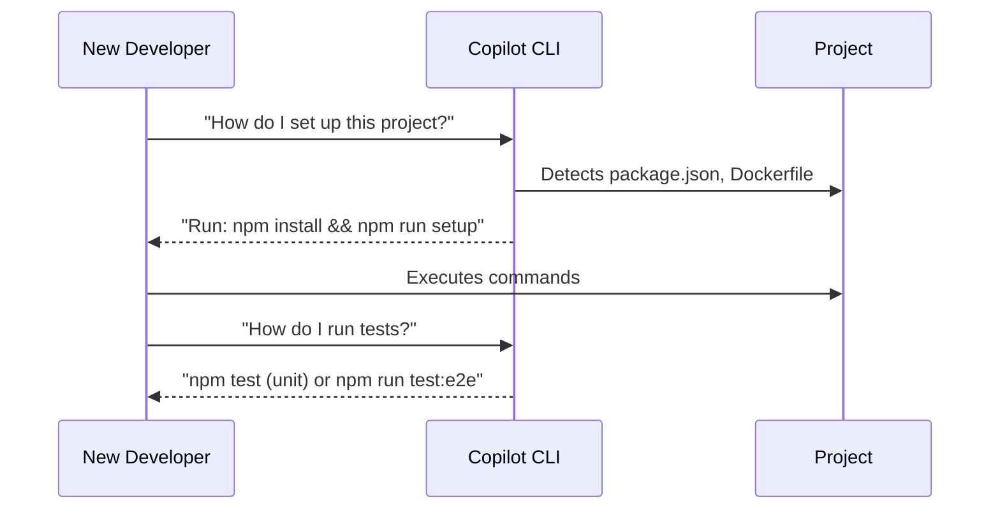

**Scenario:** A new developer joins a team and needs to set up the project.

**Copilot CLI Assistance:**
```bash
$ gh copilot suggest "setup this project for development"

Detected:
- package.json (Node.js project)
- Dockerfile (containerized)
- .env.example (environment variables)

Setup steps:
1. npm install
2. cp .env.example .env
3. docker-compose up -d
4. npm run db:migrate
5. npm run dev

Execute all steps? [y/N]
```

### Use Case 2: Production Incident Response

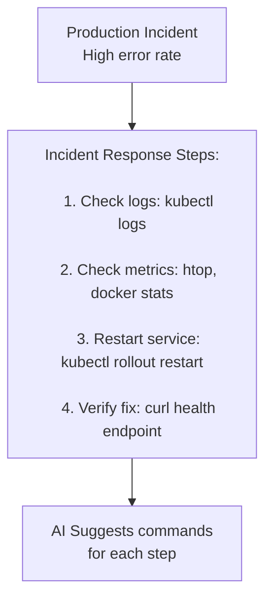

**Scenario:** Responding to a production incident under pressure.

**Copilot CLI Assistance:**
```bash
$ gh copilot workflow "check production service health and restart if needed"

Workflow:

# 1. Check service status
kubectl get pods -n production
kubectl describe deployment myapp -n production

# 2. View recent logs
kubectl logs -l app=myapp -n production --tail=100

# 3. Check resource usage
kubectl top pods -n production

# 4. If unhealthy, restart
kubectl rollout restart deployment/myapp -n production

# 5. Verify restart
kubectl rollout status deployment/myapp -n production

Execute? [y/N]
```

### Use Case 3: Database Maintenance

```bash
$ gh copilot suggest "backup PostgreSQL database and compress"

Suggested command sequence:

# 1. Dump database
pg_dump mydb > mydb_backup.sql

# 2. Compress
gzip mydb_backup.sql

# 3. Optionally, copy to backup location
cp mydb_backup.sql.gz /backups/

Alternative (single command):
pg_dump mydb | gzip > mydb_backup_$(date +%Y%m%d).sql.gz

Would you like to execute? [y/N]
```

### Use Case 4: CI/CD Pipeline Debugging


**Scenario:** A CI/CD pipeline fails locally or in CI.

**Copilot CLI Assistance:**
```bash
$ npm run build
> Error: Command failed: npm run lint

$ gh copilot diagnose

🔍 Error Analysis:

Linting failed due to formatting issues.

Suggested fixes:

1. Run linter with auto-fix:
   npm run lint -- --fix

2. Or check specific files:
   npx eslint src/ --fix

3. Preview errors without fixing:
   npm run lint

Would you like to run the auto-fix? [y/N]
```

---

## Best Practices for Copilot in the Terminal

### For Command Suggestions

1. **Be descriptive** – "Find all JavaScript files modified in the last day" works better than "find js files"
2. **Specify constraints** – Include file sizes, dates, or patterns
3. **Review commands** – Always verify generated commands before execution

### For Script Generation

1. **Add error handling** – Ask Copilot to include `set -e` or error checking
2. **Include comments** – Generated scripts should be readable
3. **Test in safe environment** – Run scripts with `-n` (dry run) first

### For Git Operations

1. **Use `--dry-run`** – For destructive operations, add `--dry-run` to preview
2. **Check git status** – Always verify current state before complex operations
3. **Review before commit** – Use `git diff` to review changes

### For Dangerous Commands

1. **Enable confirmations** – Configure `confirm_dangerous: true`
2. **Use `--dry-run`** – Many commands support preview mode
3. **Start safe** – Use `rm -i` (interactive) for file deletion

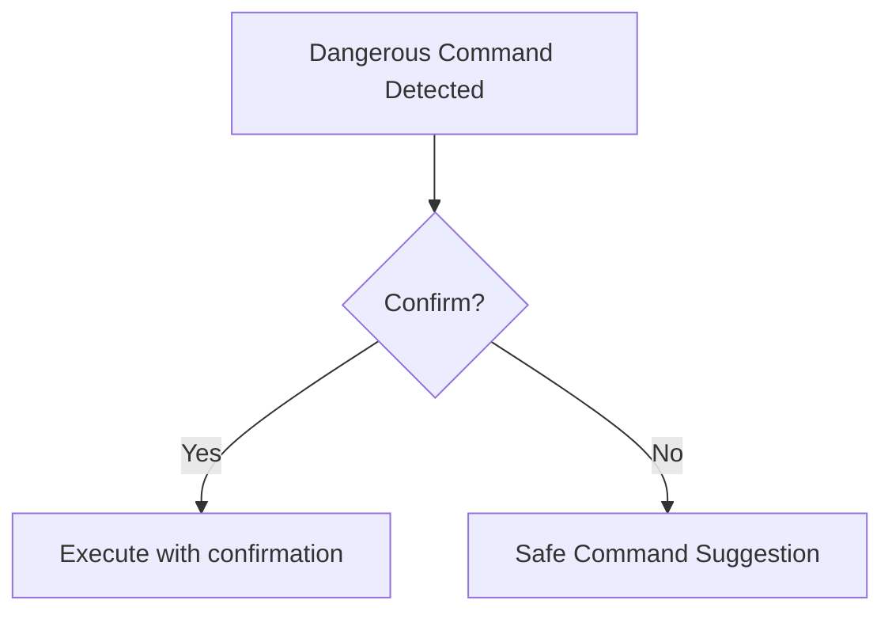

---

## What's New in Terminal (2025-2026)

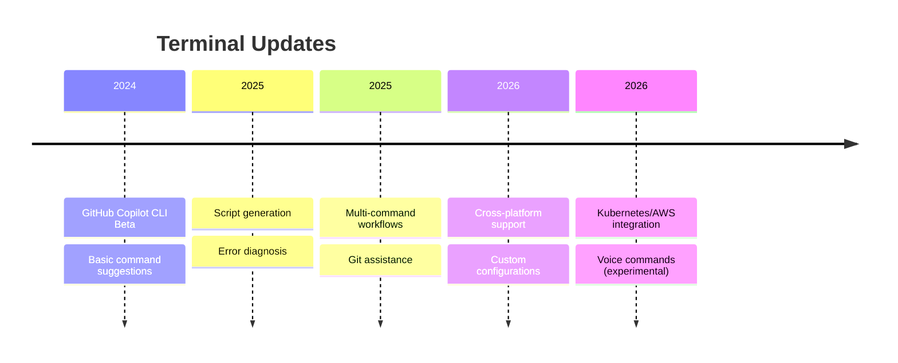

### Latest Features

- **Command Suggestions** – Natural language to shell commands
- **Script Generation** – Create bash, PowerShell, Python scripts
- **Error Diagnosis** – AI explains and fixes command failures
- **Git Assistance** – Simplify complex Git operations
- **Multi-Command Workflows** – Chain commands for complex tasks
- **Alias Generation** – Create shortcuts automatically
- **Cross-Platform** – Works on Linux, macOS, Windows

### Coming Soon

- **Voice Commands** – Speak to your terminal
- **Predictive Commands** – AI suggests commands before you type
- **Automated Workflows** – Scheduled AI-managed tasks
- **Team Command Libraries** – Share AI-generated commands
- **Natural Language Scripting** – Write scripts in English

---

## Measuring Terminal Productivity

### Time Savings

```mermaid
gantt
    title Command Discovery: Before vs After Copilot
    dateFormat HH:mm
    axisFormat %H:%M
    
    section Complex Git Operation
    Manual :00:00, 8m
    Copilot:08m, 1m
    
    section Docker Command
    Manual :09m, 5m
    Copilot:14m, 30s
    
    section Script Creation
    Manual :14m, 15m
    Copilot:29m, 3m
    
    section Error Diagnosis
    Manual :32m, 12m
    Copilot:44m, 2m
```

| Metric | Without Copilot | With Copilot | Improvement |
|--------|-----------------|--------------|-------------|
| Command discovery | 2-8 min | 10-30 sec | 80-95% faster |
| Git operation time | 3-15 min | 30-90 sec | 80-90% faster |
| Script creation | 15-60 min | 3-10 min | 75-85% faster |
| Error diagnosis | 5-30 min | 1-5 min | 70-85% faster |
| Learning new tools | 30-120 min | 5-15 min | 80-90% faster |

### Developer Experience

```mermaid
pie title Developer Terminal Experience
    "Feel more confident in terminal (85%)" : 85
    "Spend less time on Stack Overflow (78%)" : 78
    "Complete tasks faster (82%)" : 82
    "Would recommend Copilot CLI (90%)" : 90
```

- **85%** of developers feel more confident using the terminal
- **78%** spend less time searching for command syntax
- **82%** complete terminal tasks faster
- **90%** would recommend Copilot CLI to others

---

## Security and Safety

### Safety Features

```mermaid
graph TD
    subgraph Safety["Safety Features"]
        Confirm[Confirmation for dangerous commands]
        Preview[Preview before execution]
        DryRun[--dry-run support]
        Explain[Explanation of what command does]
        Alternative[Alternative safe commands]
    end
    
    subgraph Dangerous["Dangerous Commands Flagged"]
        RM[rm -rf /]
        DD[dd commands]
        Chmod[chmod 777]
        Sudo[sudo with risky commands]
        Drop[Database drops]
    end
    
    Safety --> Dangerous
```

**Dangerous Command Warning:**
```bash
$ gh copilot suggest "delete everything in current directory"

⚠️ DANGEROUS COMMAND DETECTED

Suggested command:
rm -rf *

This will permanently delete all files in the current directory.

Safety options:
1. Preview what would be deleted: ls -la
2. Move to trash instead: mv * ~/.Trash/
3. Interactive deletion: rm -ri *

Continue with rm -rf *? [y/N]
```

---

## GitHub Copilot CLI Pricing

| Plan | Terminal Features | Pricing |
|------|-------------------|---------|
| **Copilot Free** | Basic suggestions, 50/month | Free |
| **Copilot Individual** | Unlimited CLI commands | $10/user/month |
| **Copilot Business** | Organization aliases, Sharing | $19/user/month |
| **Copilot Enterprise** | Custom workflows, Team libraries | $39/user/month |

---

## Conclusion

GitHub Copilot in the Terminal transforms the command line from a place of memorization and syntax hunting into an intuitive, AI-powered interface. Whether you're:

- **Discovering commands** – Describe what you want, get the exact syntax
- **Understanding complex operations** – AI explains what a command does
- **Automating tasks** – Generate complete scripts from natural language
- **Debugging failures** – AI diagnoses and fixes errors
- **Managing Git** – Simplify complex version control operations
- **Working with containers** – Get help with Docker and Kubernetes
- **Learning new tools** – Copilot guides you through unfamiliar commands

Copilot CLI meets you where you live—in the terminal—making you faster, more confident, and more productive.

```mermaid
graph TD
    subgraph Terminal["Your Terminal"]
        User[Developer]
        Shell[Shell]
    end
    
    subgraph Copilot["GitHub Copilot CLI"]
        Suggest[Command Suggestions]
        Explain[Command Explanations]
        Script[Script Generation]
        Diagnose[Error Diagnosis]
    end
    
    subgraph Outcomes["Outcomes"]
        Fast[Faster Commands]
        Confident[More Confidence]
        Learn[Accelerated Learning]
        Safe[Safer Operations]
    end
    
    User --> Copilot
    Copilot --> Shell
    Copilot --> Outcomes
    
    style Copilot fill:#0a3069,stroke:#0a3069,stroke-width:2px,color:#fff
```

---

## Next in the Series

- **📝 In the IDE** – Your AI pair programmer, always by your side
- **🌐 GitHub.com** – AI-powered collaboration at scale
- **💻 This story:** In the Terminal – Your command line AI assistant
- **⚙️ In CI/CD** – AI-powered automation in your pipelines

---

## Complete Story Links

- [📖 **GitHub Copilot** – The AI-Powered Development Ecosystem](#)   
- 📝 **In the IDE** – Your AI pair programmer, always by your side - Comming soon 
- 🌐 **GitHub.com** – AI-powered collaboration at scale -  - Comming soon 
- 💻 **In the Terminal** – Your command line AI assistant - - Comming soon  
- ⚙️ **In CI/CD** – AI-powered automation in your pipelines - - Comming soon  
- 📘 **VS Code Integration** – The ultimate AI-powered development experience - Comming soon  
- 🎯 **Visual Studio Integration** – Enterprise-grade AI for .NET developers - - Comming soon  

---

**Get Started with GitHub Copilot CLI**

```bash
# Install GitHub CLI
brew install gh  # macOS
sudo apt install gh  # Ubuntu/Debian
winget install --id GitHub.cli  # Windows

# Install Copilot CLI extension
gh extension install github/gh-copilot

# Start using Copilot
gh copilot suggest "your command description"

# Or try it now
gh copilot suggest "find all Python files modified in the last week"
```

Start your AI-powered terminal journey at [github.com/features/copilot](https://github.com/features/copilot)

---

*This story is part of the GitHub Copilot Ecosystem Series. Last updated March 2026.*

_Questions? Feedback? Comment? leave a response below. If you're implementing something similar and want to discuss architectural tradeoffs, I'm always happy to connect with fellow engineers tackling these challenges._