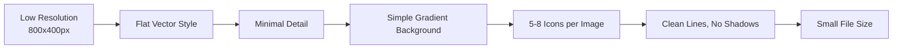

Here are the **refined image prompts** with:
- ✅ **Background**: Light yellow, blue, and orange mix
- ✅ **Low resolution / small file size** optimization
- ✅ **No badge** (removed "Parent Story" / "The AI-Powered Development Ecosystem")
- ✅ Consistent across all 7 stories

---

## Unified Background Specification

**BACKGROUND:** Soft gradient blending light yellow (#FFF3E0), light blue (#E6F0FA), and soft orange (#FFE4CC). Subtle tech pattern: faint circuit traces, dotted grid lines, floating binary particles in very light gray. Clean, minimal, not distracting.

---

## Parent Story

### GitHub Copilot: The AI-Powered Development Ecosystem

**Title:** *GitHub Copilot: The AI-Powered Development Ecosystem*
**Subtitle:** *From Autocomplete to AI Engineering Partner — Across Every Surface Where You Build Software*

```
Generate a low-resolution (800x400px, small file size) horizontal story card image with:

BACKGROUND: Soft gradient blending light yellow (#FFF3E0), light blue (#E6F0FA), and soft orange (#FFE4CC). Subtle tech pattern: faint circuit traces and dotted grid lines in very light gray. Clean, minimal.

MAIN VISUAL: Central GitHub Copilot robot head icon (blue and green) radiating flowing connection lines to four development surfaces arranged in a semicircle:
- Top left: VS Code editor window with code lines
- Top right: Terminal window with command prompt
- Bottom left: GitHub pull request interface
- Bottom right: CI/CD pipeline flowchart (test → build → deploy)

Connection lines have small node points. Scattered small icons: JavaScript (yellow), Python (blue), .NET (purple), Docker (blue), Git (red/black). Simple flat vector style.

TEXT ELEMENTS:
- Top center: "GitHub Copilot: The AI-Powered Development Ecosystem" in bold modern sans-serif, dark gray
- Below title: "From Autocomplete to AI Engineering Partner — Across Every Surface Where You Build Software" in medium size, warm gray
- Bottom right: "Vineet Sharma" in small elegant font, dark amber

STYLE: Flat vector illustration, clean lines, minimal, low-detail, optimized for small file size. Use accent colors: Copilot green (#2da44e), VS Code blue (#007acc), GitHub purple (#6e40c9), soft orange (#FFB347).
```

---

## Story 1: In the IDE

### GitHub Copilot in the IDE: Your AI Pair Programmer, Always by Your Side

**Title:** *GitHub Copilot in the IDE*
**Subtitle:** *Your AI Pair Programmer, Always by Your Side*

```
Generate a low-resolution (800x400px, small file size) horizontal story card image with:

BACKGROUND: Soft gradient blending light yellow (#FFF3E0), light blue (#E6F0FA), and soft orange (#FFE4CC). Subtle tech pattern: faint dotted grid lines in very light gray. Clean, minimal.

MAIN VISUAL: VS Code style editor interface:
- Left: JavaScript/TypeScript file with gray ghost text showing inline suggestion (function)
- Right: Copilot Chat sidebar with conversation bubble
- Floating near editor: inline chat overlay showing diff preview
- Status bar showing Copilot active icon

Scattered small icons: React, TypeScript, Python, Go. Simple flat vector style.

TEXT ELEMENTS:
- Top center: "GitHub Copilot in the IDE" in bold modern sans-serif, dark gray
- Below title: "Your AI Pair Programmer, Always by Your Side" in medium size, warm gray
- Bottom right: "Vineet Sharma" in small elegant font, dark amber

STYLE: Flat vector illustration, clean lines, minimal, low-detail, optimized for small file size. Use Copilot green (#2da44e), VS Code blue (#007acc), soft orange (#FFB347).
```

---

## Story 2: GitHub.com

### GitHub Copilot on GitHub.com: AI-Powered Collaboration at Scale

**Title:** *GitHub Copilot on GitHub.com*
**Subtitle:** *AI-Powered Collaboration at Scale*

```
Generate a low-resolution (800x400px, small file size) horizontal story card image with:

BACKGROUND: Soft gradient blending light yellow (#FFF3E0), light blue (#E6F0FA), and soft orange (#FFE4CC). Subtle tech pattern: faint network connection dots in very light gray. Clean, minimal.

MAIN VISUAL: GitHub.com interface elements:
- Center: Pull request screen with diff view
- Glowing Copilot icon above PR with flowing lines
- Left: Issue tracker with checklist
- Right: Discussions with Q&A bubbles

Scattered small icons: GitHub Octocat, Git, GitHub Actions, JavaScript, Python. Simple flat vector style.

TEXT ELEMENTS:
- Top center: "GitHub Copilot on GitHub.com" in bold modern sans-serif, dark gray
- Below title: "AI-Powered Collaboration at Scale" in medium size, warm gray
- Bottom right: "Vineet Sharma" in small elegant font, dark amber

STYLE: Flat vector illustration, clean lines, minimal, low-detail, optimized for small file size. Use Copilot green (#2da44e), GitHub purple (#6e40c9), soft orange (#FFB347).
```

---

## Story 3: In the Terminal

### GitHub Copilot in the Terminal: Your Command Line AI Assistant

**Title:** *GitHub Copilot in the Terminal*
**Subtitle:** *Your Command Line AI Assistant*

```
Generate a low-resolution (800x400px, small file size) horizontal story card image with:

BACKGROUND: Soft gradient blending light yellow (#FFF3E0), light blue (#E6F0FA), and soft orange (#FFE4CC). Subtle tech pattern: faint terminal cursor trails in very light gray. Clean, minimal.

MAIN VISUAL: Terminal window:
- Natural language: "> find large files over 100MB"
- AI-generated command in green: "find . -type f -size +100M"
- Second pane showing bash script

Scattered small icons: Bash, Python, Git, Docker, Kubernetes. Simple flat vector style.

TEXT ELEMENTS:
- Top center: "GitHub Copilot in the Terminal" in bold modern sans-serif, dark gray
- Below title: "Your Command Line AI Assistant" in medium size, warm gray
- Bottom right: "Vineet Sharma" in small elegant font, dark amber

STYLE: Flat vector illustration, clean lines, minimal, low-detail, optimized for small file size. Use Copilot green (#2da44e), terminal green (#00aa00), soft orange (#FFB347).
```

---

## Story 4: In CI/CD

### GitHub Copilot in CI/CD: AI-Powered Automation at Scale

**Title:** *GitHub Copilot in CI/CD*
**Subtitle:** *AI-Powered Automation at Scale*

```
Generate a low-resolution (800x400px, small file size) horizontal story card image with:

BACKGROUND: Soft gradient blending light yellow (#FFF3E0), light blue (#E6F0FA), and soft orange (#FFE4CC). Subtle tech pattern: faint pipeline flow arrows in very light gray. Clean, minimal.

MAIN VISUAL: CI/CD pipeline:
- Left to right: Code → Test → Build → Deploy → Monitor
- Each stage with small Copilot icon
- GitHub Actions YAML file above
- Debug panel below with error and fix suggestion

Scattered small icons: GitHub Actions, Docker, Kubernetes, AWS, Azure. Simple flat vector style.

TEXT ELEMENTS:
- Top center: "GitHub Copilot in CI/CD" in bold modern sans-serif, dark gray
- Below title: "AI-Powered Automation at Scale" in medium size, warm gray
- Bottom right: "Vineet Sharma" in small elegant font, dark amber

STYLE: Flat vector illustration, clean lines, minimal, low-detail, optimized for small file size. Use Copilot green (#2da44e), CI/CD red (#cf222e), soft orange (#FFB347).
```

---

## Story 5: VS Code Integration

### GitHub Copilot in VS Code: The Ultimate AI-Powered Development Experience

**Title:** *GitHub Copilot in VS Code*
**Subtitle:** *The Ultimate AI-Powered Development Experience*

```
Generate a low-resolution (800x400px, small file size) horizontal story card image with:

BACKGROUND: Soft gradient blending light yellow (#FFF3E0), light blue (#E6F0FA), and soft orange (#FFE4CC). Subtle tech pattern: faint editor grid lines in very light gray. Clean, minimal.

MAIN VISUAL: VS Code interface:
- TypeScript file with gray inline suggestion
- Chat sidebar with conversation
- Inline chat diff preview
- Command palette showing "/edit"

Scattered small icons: VS Code, JavaScript, TypeScript, React, Python, Node.js. Simple flat vector style.

TEXT ELEMENTS:
- Top center: "GitHub Copilot in VS Code" in bold modern sans-serif, dark gray
- Below title: "The Ultimate AI-Powered Development Experience" in medium size, warm gray
- Bottom right: "Vineet Sharma" in small elegant font, dark amber

STYLE: Flat vector illustration, clean lines, minimal, low-detail, optimized for small file size. Use Copilot green (#2da44e), VS Code blue (#007acc), soft orange (#FFB347).
```

---

## Story 6: Visual Studio Integration

### GitHub Copilot in Visual Studio: Enterprise-Grade AI for .NET Developers

**Title:** *GitHub Copilot in Visual Studio*
**Subtitle:** *Enterprise-Grade AI for .NET Developers*

```
Generate a low-resolution (800x400px, small file size) horizontal story card image with:

BACKGROUND: Soft gradient blending light yellow (#FFF3E0), light blue (#E6F0FA), and soft orange (#FFE4CC). Subtle tech pattern: faint architecture diagram lines in very light gray. Clean, minimal.

MAIN VISUAL: Visual Studio interface:
- C# code editor with inline suggestion
- Solution Explorer with multi-project structure
- Debugger panel with AI analysis
- Copilot Chat tool window

Scattered small icons: .NET, C#, Azure, SQL Server, Entity Framework, Blazor. Simple flat vector style.

TEXT ELEMENTS:
- Top center: "GitHub Copilot in Visual Studio" in bold modern sans-serif, dark gray
- Below title: "Enterprise-Grade AI for .NET Developers" in medium size, warm gray
- Bottom right: "Vineet Sharma" in small elegant font, dark amber

STYLE: Flat vector illustration, clean lines, minimal, low-detail, optimized for small file size. Use Copilot green (#2da44e), Visual Studio purple (#5c2d91), soft orange (#FFB347).
```

---

## Summary Table

| Story | Title | Subtitle |
|-------|-------|----------|
| **Parent** | GitHub Copilot: The AI-Powered Development Ecosystem | From Autocomplete to AI Engineering Partner — Across Every Surface Where You Build Software |
| **1** | GitHub Copilot in the IDE | Your AI Pair Programmer, Always by Your Side |
| **2** | GitHub Copilot on GitHub.com | AI-Powered Collaboration at Scale |
| **3** | GitHub Copilot in the Terminal | Your Command Line AI Assistant |
| **4** | GitHub Copilot in CI/CD | AI-Powered Automation at Scale |
| **5** | GitHub Copilot in VS Code | The Ultimate AI-Powered Development Experience |
| **6** | GitHub Copilot in Visual Studio | Enterprise-Grade AI for .NET Developers |

---

## Color Palette

| Element | Color | Usage |
|---------|-------|-------|
| Light Yellow | #FFF3E0 | Background gradient |
| Light Blue | #E6F0FA | Background gradient |
| Soft Orange | #FFE4CC | Background gradient |
| Copilot Green | #2da44e | Primary accent |
| VS Code Blue | #007acc | VS Code accent |
| GitHub Purple | #6e40c9 | GitHub accent |
| CI/CD Red | #cf222e | Pipeline accent |
| Terminal Green | #00aa00 | Command output |
| Visual Studio Purple | #5c2d91 | VS accent |
| Soft Orange Accent | #FFB347 | Secondary accent |

---

## Optimization Notes



---

These prompts now feature:
- ✅ **Background**: Light yellow, blue, and orange mix
- ✅ **Low resolution / small file size** optimized
- ✅ **No badges** (removed all)
- ✅ **Clean, minimal flat vector style**
- ✅ **Consistent design** across all 7 stories
- ✅ **"Vineet Sharma"** attribution at bottom right