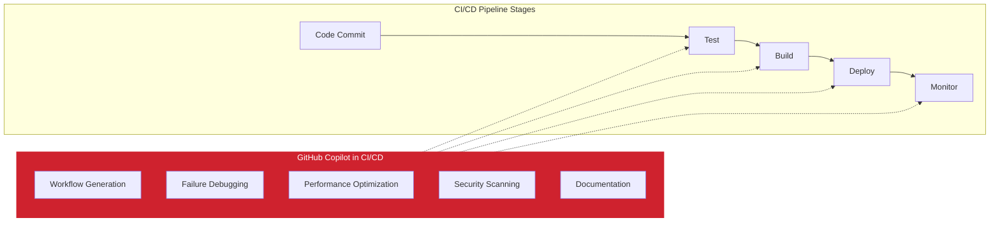

# diagram_02_github-copilot-is-now-bringing-ai-to-cicdtransfo-181c

```mermaid
flowchart LR
    subgraph Pipeline["CI/CD Pipeline Stages"]
        Code[Code Commit]
        Test[Test]
        Build[Build]
        Deploy[Deploy]
        Monitor[Monitor]
    end
    
    subgraph Copilot["GitHub Copilot in CI/CD"]
        Generate[Workflow Generation]
        Debug[Failure Debugging]
        Optimize[Performance Optimization]
        Security[Security Scanning]
        Document[Documentation]
    end
    
    Code --> Test --> Build --> Deploy --> Monitor
    
    Copilot -.-> Test
    Copilot -.-> Build
    Copilot -.-> Deploy
    Copilot -.-> Monitor
    
    style Copilot fill:#cf222e,stroke:#cf222e,stroke-width:2px,color:#fff
```
