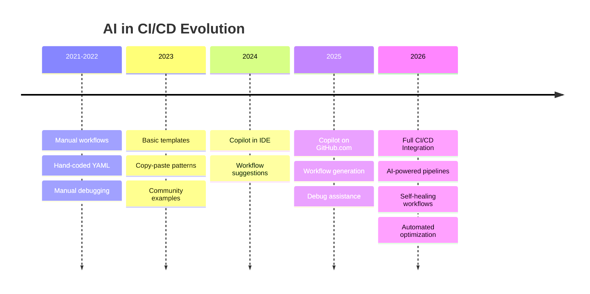

# diagram_03_the-evolution-of-ai-in-cicd

```mermaid
timeline
    title AI in CI/CD Evolution
    2021-2022 : Manual workflows
              : Hand-coded YAML
              : Manual debugging
    2023 : Basic templates
         : Copy-paste patterns
         : Community examples
    2024 : Copilot in IDE
         : Workflow suggestions
    2025 : Copilot on GitHub.com
         : Workflow generation
         : Debug assistance
    2026 : Full CI/CD Integration
         : AI-powered pipelines
         : Self-healing workflows
         : Automated optimization
```
