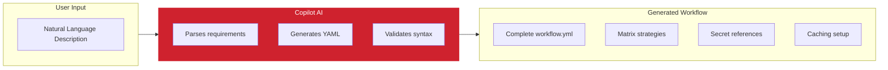

# diagram_04_untitled

```mermaid
flowchart LR
    subgraph Input["User Input"]
        Desc[Natural Language Description]
    end
    
    subgraph AI["Copilot AI"]
        Parse[Parses requirements]
        Generate[Generates YAML]
        Validate[Validates syntax]
    end
    
    subgraph Output["Generated Workflow"]
        YAML[Complete workflow.yml]
        Matrix[Matrix strategies]
        Secrets[Secret references]
        Caching[Caching setup]
    end
    
    Input --> AI --> Output
    
    style AI fill:#cf222e,stroke:#cf222e,stroke-width:2px,color:#fff
```
