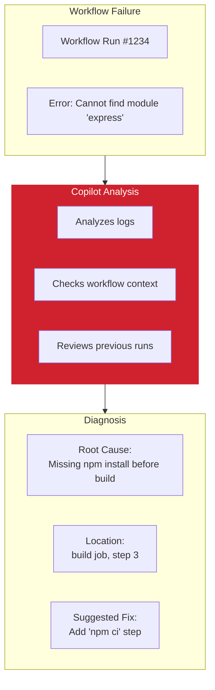

# diagram_05_workflow-failure-analysis

```mermaid
flowchart TD
    subgraph Failure["Workflow Failure"]
        Run[Workflow Run #1234]
        Error[Error: Cannot find module 'express']
    end
    
    subgraph Analysis["Copilot Analysis"]
        Logs[Analyzes logs]
        Context[Checks workflow context]
        History[Reviews previous runs]
    end
    
    subgraph Diagnosis["Diagnosis"]
        Root[Root Cause:<br/>Missing npm install before build]
        Location[Location:<br/>build job, step 3]
        Suggestion[Suggested Fix:<br/>Add 'npm ci' step]
    end
    
    Failure --> Analysis --> Diagnosis
    
    style Analysis fill:#cf222e,stroke:#cf222e,stroke-width:2px,color:#fff
```
