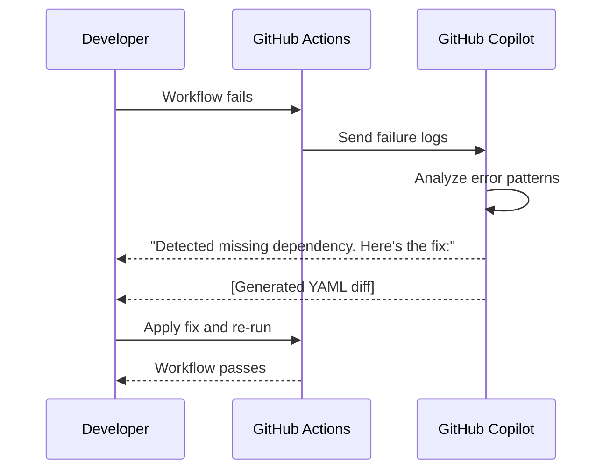

# diagram_06_copilot-can-go-beyond-diagnosis-and-suggest-comple-707b

```mermaid
sequenceDiagram
    participant Dev as Developer
    participant GitHub as GitHub Actions
    participant Copilot as GitHub Copilot
    
    Dev->>GitHub: Workflow fails
    GitHub->>Copilot: Send failure logs
    Copilot->>Copilot: Analyze error patterns
    Copilot-->>Dev: "Detected missing dependency. Here's the fix:"
    Copilot-->>Dev: [Generated YAML diff]
    Dev->>GitHub: Apply fix and re-run
    GitHub-->>Dev: Workflow passes
```
