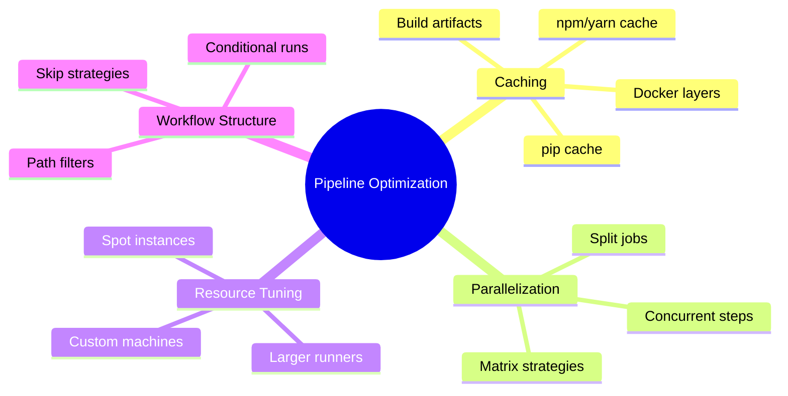

# diagram_07_optimization-suggestions

```mermaid
mindmap
  root((Pipeline Optimization))
    Caching
      npm/yarn cache
      pip cache
      Docker layers
      Build artifacts
    Parallelization
      Matrix strategies
      Split jobs
      Concurrent steps
    Resource Tuning
      Larger runners
      Custom machines
      Spot instances
    Workflow Structure
      Conditional runs
      Path filters
      Skip strategies
```
