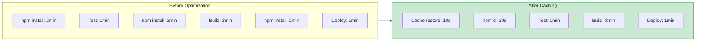

# diagram_08_caching-recommendations

```mermaid
flowchart LR
    subgraph Before["Before Optimization"]
        Install1[npm install: 2min]
        Test1[Test: 1min]
        Install2[npm install: 2min]
        Build[Build: 3min]
        Install3[npm install: 2min]
        Deploy[Deploy: 1min]
    end
    
    subgraph After["After Caching"]
        Cache[Cache restore: 10s]
        Install1C[npm ci: 30s]
        Test1C[Test: 1min]
        BuildC[Build: 3min]
        DeployC[Deploy: 1min]
    end
    
    Before --> After
    
    style After fill:#2da44e40,stroke:#2da44e,stroke-width:1px
```
