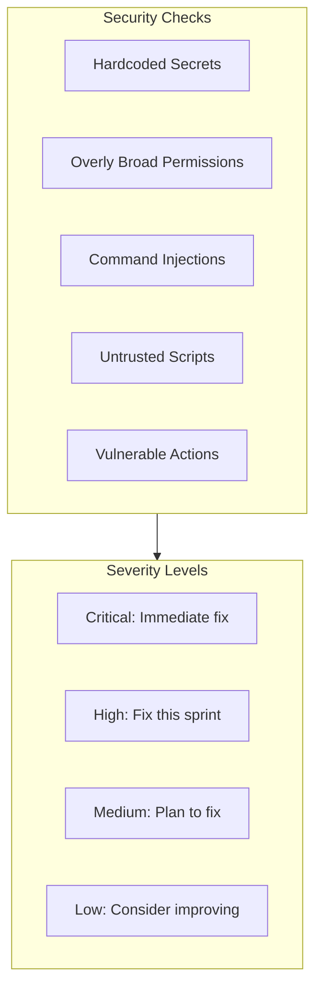

# diagram_09_workflow-security-analysis

```mermaid
graph TD
    subgraph SecurityChecks["Security Checks"]
        Secrets[Hardcoded Secrets]
        Permissions[Overly Broad Permissions]
        Injections[Command Injections]
        Scripts[Untrusted Scripts]
        Actions[Vulnerable Actions]
    end
    
    subgraph Severity["Severity Levels"]
        Critical[Critical: Immediate fix]
        High[High: Fix this sprint]
        Medium[Medium: Plan to fix]
        Low[Low: Consider improving]
    end
    
    SecurityChecks --> Severity
```
