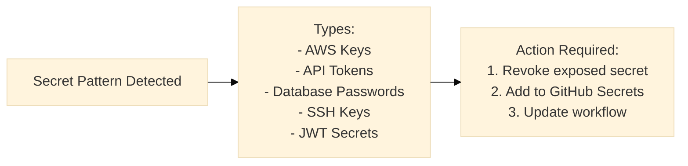

# diagram_10_copilot-automatically-detects-patterns-that-look-l-3167

```mermaid
---
config:
  theme: base
  layout: elk
---
flowchart LR
    Pattern[Secret Pattern Detected]
    Types[Types:<br/>- AWS Keys<br/>- API Tokens<br/>- Database Passwords<br/>- SSH Keys<br/>- JWT Secrets]
    Action[Action Required:<br/>1. Revoke exposed secret<br/>2. Add to GitHub Secrets<br/>3. Update workflow]
    
    Pattern --> Types
    Types --> Action
```
