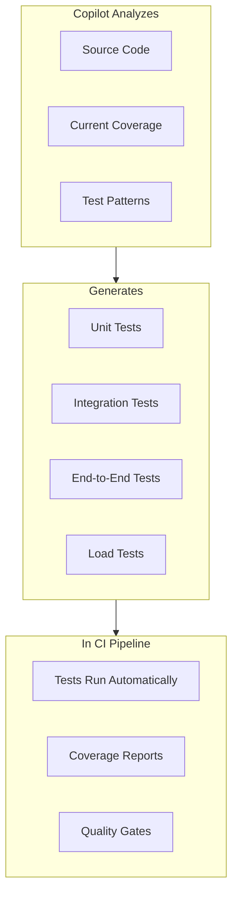

# diagram_11_automated-test-generation

```mermaid
flowchart TD
    subgraph Input["Copilot Analyzes"]
        Code[Source Code]
        Coverage[Current Coverage]
        Patterns[Test Patterns]
    end
    
    subgraph Generation["Generates"]
        Unit[Unit Tests]
        Integration[Integration Tests]
        E2E[End-to-End Tests]
        Load[Load Tests]
    end
    
    subgraph Output["In CI Pipeline"]
        Run[Tests Run Automatically]
        Report[Coverage Reports]
        Quality[Quality Gates]
    end
    
    Input --> Generation --> Output
```
