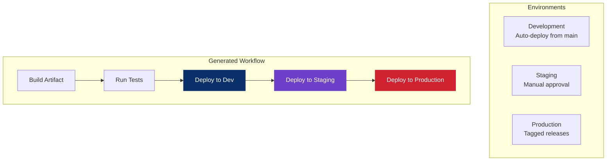

# diagram_12_multi-environment-deployment

```mermaid
flowchart TD
    subgraph Env["Environments"]
        Dev[Development<br/>Auto-deploy from main]
        Staging[Staging<br/>Manual approval]
        Prod[Production<br/>Tagged releases]
    end
    
    subgraph Workflow["Generated Workflow"]
        Build[Build Artifact]
        Test[Run Tests]
        DevDeploy[Deploy to Dev]
        StagingDeploy[Deploy to Staging]
        ProdDeploy[Deploy to Production]
    end
    
    Build --> Test --> DevDeploy
    DevDeploy --> StagingDeploy
    StagingDeploy --> ProdDeploy
    
    style DevDeploy fill:#0a3069,stroke:#0a3069,stroke-width:1px,color:#fff
    style StagingDeploy fill:#6e40c9,stroke:#6e40c9,stroke-width:1px,color:#fff
    style ProdDeploy fill:#cf222e,stroke:#cf222e,stroke-width:1px,color:#fff
```
