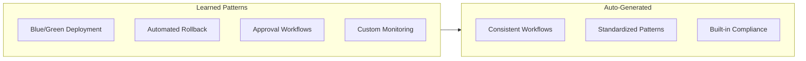

# diagram_15_copilot-learns-your-organizations-deployment-patt-6fee

```mermaid
flowchart LR
    subgraph Patterns["Learned Patterns"]
        Deploy[Blue/Green Deployment]
        Rollback[Automated Rollback]
        Approval[Approval Workflows]
        Monitoring[Custom Monitoring]
    end
    
    subgraph Generation["Auto-Generated"]
        Workflows[Consistent Workflows]
        Standards[Standardized Patterns]
        Compliance[Built-in Compliance]
    end
    
    Patterns --> Generation
```
