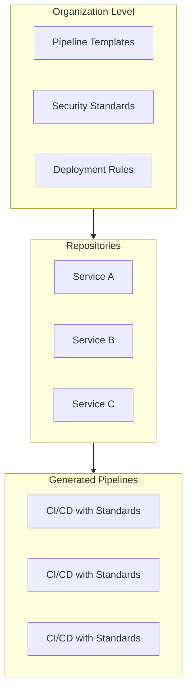

# diagram_16_organization-wide-pipeline-management-614a

```mermaid
graph TD
    subgraph Org["Organization Level"]
        Templates[Pipeline Templates]
        Standards[Security Standards]
        Rules[Deployment Rules]
    end
    
    subgraph Repos["Repositories"]
        Repo1[Service A]
        Repo2[Service B]
        Repo3[Service C]
    end
    
    subgraph Pipelines["Generated Pipelines"]
        Pipeline1[CI/CD with Standards]
        Pipeline2[CI/CD with Standards]
        Pipeline3[CI/CD with Standards]
    end
    
    Org --> Repos --> Pipelines
```
