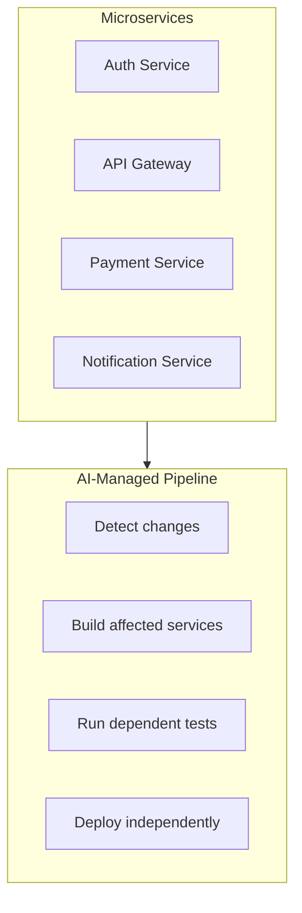

# diagram_17_use-case-1-microservices-deployment-f3ca

```mermaid
flowchart TD
    subgraph Services["Microservices"]
        Auth[Auth Service]
        API[API Gateway]
        Payment[Payment Service]
        Notification[Notification Service]
    end
    
    subgraph Pipeline["AI-Managed Pipeline"]
        Detect[Detect changes]
        Build[Build affected services]
        Test[Run dependent tests]
        Deploy[Deploy independently]
    end
    
    Services --> Pipeline
```
