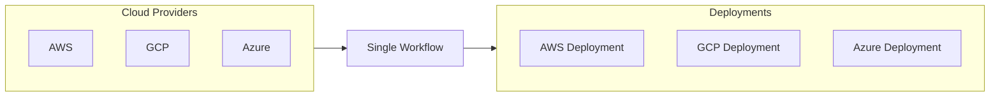

# diagram_19_use-case-3-multi-cloud-deployment-b250

```mermaid
graph LR
    subgraph Clouds["Cloud Providers"]
        AWS[AWS]
        GCP[GCP]
        Azure[Azure]
    end
    
    Workflow[Single Workflow]
    
    subgraph Deployments["Deployments"]
        AWSDeploy[AWS Deployment]
        GCPDeploy[GCP Deployment]
        AzureDeploy[Azure Deployment]
    end
    
    Clouds --> Workflow --> Deployments
```
