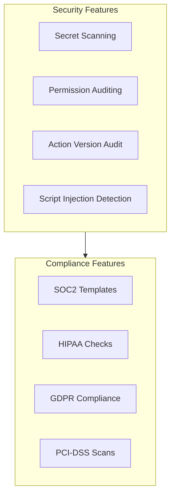

# diagram_23_security-features

```mermaid
graph TD
    subgraph Security["Security Features"]
        SecretScan[Secret Scanning]
        Permissions[Permission Auditing]
        ActionAudit[Action Version Audit]
        ScriptCheck[Script Injection Detection]
    end
    
    subgraph Compliance["Compliance Features"]
        SOC2[SOC2 Templates]
        HIPAA[HIPAA Checks]
        GDPR[GDPR Compliance]
        PCI[PCI-DSS Scans]
    end
    
    Security --> Compliance
```
