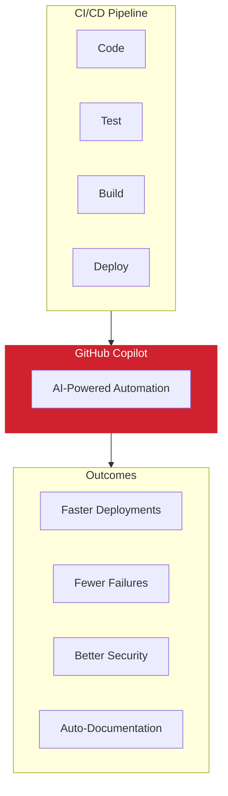

# diagram_24_copilot-in-cicd-ensures-your-automation-is-fast-7135

```mermaid
graph TD
    subgraph Pipeline["CI/CD Pipeline"]
        Code[Code]
        Test[Test]
        Build[Build]
        Deploy[Deploy]
    end
    
    subgraph Copilot["GitHub Copilot"]
        AI[AI-Powered Automation]
    end
    
    subgraph Outcomes["Outcomes"]
        Fast[Faster Deployments]
        Reliable[Fewer Failures]
        Secure[Better Security]
        Docs[Auto-Documentation]
    end
    
    Pipeline --> Copilot
    Copilot --> Outcomes
    
    style Copilot fill:#cf222e,stroke:#cf222e,stroke-width:2px,color:#fff
```
