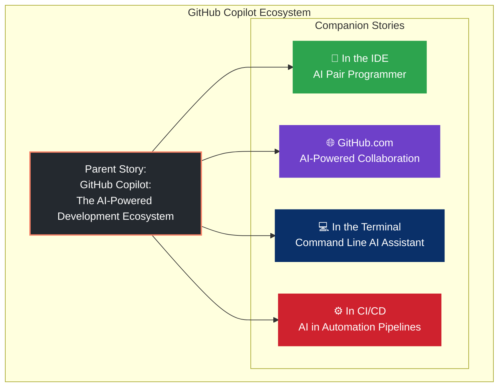

# Each story explores how GitHub Copilot transforms 

```mermaid
graph TB
    subgraph "GitHub Copilot Ecosystem"
        Parent[Parent Story:<br/>GitHub Copilot:<br/>The AI-Powered Development Ecosystem]
        
        subgraph "Companion Stories"
            IDE[📝 In the IDE<br/>AI Pair Programmer]
            GH[🌐 GitHub.com<br/>AI-Powered Collaboration]
            TERM[💻 In the Terminal<br/>Command Line AI Assistant]
            CICD[⚙️ In CI/CD<br/>AI in Automation Pipelines]
        end
        
        Parent --> IDE
        Parent --> GH
        Parent --> TERM
        Parent --> CICD
    end
    
    style Parent fill:#24292f,stroke:#f78166,stroke-width:2px,color:#fff
    style IDE fill:#2da44e,stroke:#2da44e,stroke-width:2px,color:#fff
    style GH fill:#6e40c9,stroke:#6e40c9,stroke-width:2px,color:#fff
    style TERM fill:#0a3069,stroke:#0a3069,stroke-width:2px,color:#fff
    style CICD fill:#cf222e,stroke:#cf222e,stroke-width:2px,color:#fff
```
