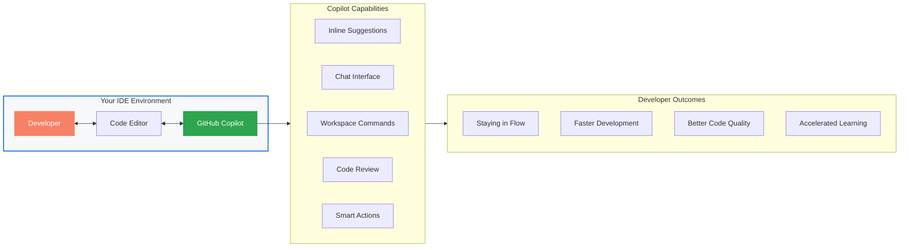

# Today, Copilot in the IDE isn't just about autocom

```mermaid
flowchart LR
    subgraph IDE["Your IDE Environment"]
        direction TB
        Editor[Code Editor]
        Copilot[GitHub Copilot]
        You[Developer]
    end
    
    You <--> Editor
    Editor <--> Copilot
    
    subgraph Capabilities["Copilot Capabilities"]
        direction LR
        Inline[Inline Suggestions]
        Chat[Chat Interface]
        Commands[Workspace Commands]
        Review[Code Review]
        Actions[Smart Actions]
    end
    
    Copilot --> Capabilities
    
    subgraph Outcomes["Developer Outcomes"]
        Flow[Staying in Flow]
        Speed[Faster Development]
        Quality[Better Code Quality]
        Learning[Accelerated Learning]
    end
    
    Capabilities --> Outcomes
    
    style IDE fill:#f6f8fa,stroke:#0969da,stroke-width:2px
    style Copilot fill:#2da44e,stroke:#2da44e,stroke-width:2px,color:#fff
    style You fill:#f78166,stroke:#f78166,stroke-width:2px,color:#fff
```
