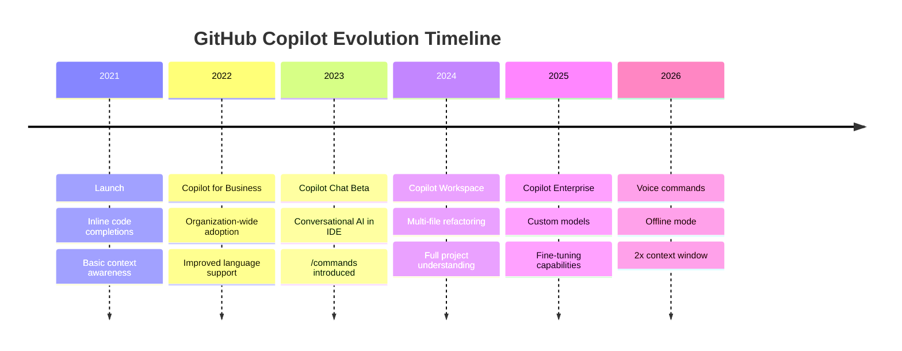

# With over **1.3 million paid subscribers** and **5

```mermaid
timeline
    title GitHub Copilot Evolution Timeline
    2021 : Launch
          : Inline code completions
          : Basic context awareness
    2022 : Copilot for Business
          : Organization-wide adoption
          : Improved language support
    2023 : Copilot Chat Beta
          : Conversational AI in IDE
          : /commands introduced
    2024 : Copilot Workspace
          : Multi-file refactoring
          : Full project understanding
    2025 : Copilot Enterprise
          : Custom models
          : Fine-tuning capabilities
    2026 : Voice commands
          : Offline mode
          : 2x context window
```
