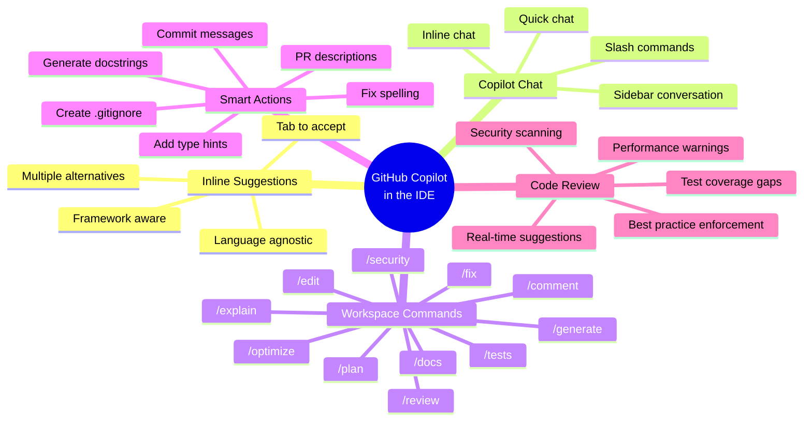

# ### Core Capabilities Overview

```mermaid
mindmap
  root((GitHub Copilot<br/>in the IDE))
    Inline Suggestions
      Tab to accept
      Multiple alternatives
      Language agnostic
      Framework aware
    Copilot Chat
      Sidebar conversation
      Inline chat
      Quick chat
      Slash commands
    Workspace Commands
      /edit
      /docs
      /tests
      /explain
      /fix
      /optimize
      /generate
      /comment
      /plan
      /review
      /security
    Smart Actions
      Commit messages
      PR descriptions
      Fix spelling
      Add type hints
      Generate docstrings
      Create .gitignore
    Code Review
      Real-time suggestions
      Security scanning
      Performance warnings
      Best practice enforcement
      Test coverage gaps
```
