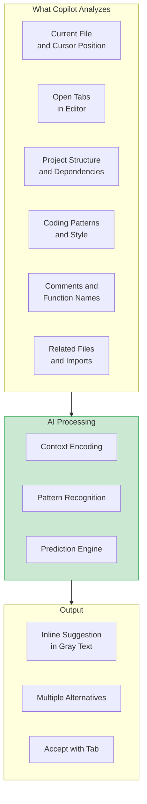

# - Related files and imports

```mermaid
flowchart TB
    subgraph Inputs["What Copilot Analyzes"]
        A[Current File<br/>and Cursor Position]
        B[Open Tabs<br/>in Editor]
        C[Project Structure<br/>and Dependencies]
        D[Coding Patterns<br/>and Style]
        E[Comments and<br/>Function Names]
        F[Related Files<br/>and Imports]
    end
    
    subgraph Processing["AI Processing"]
        G[Context Encoding]
        H[Pattern Recognition]
        I[Prediction Engine]
    end
    
    subgraph Output["Output"]
        J[Inline Suggestion<br/>in Gray Text]
        K[Multiple Alternatives]
        L[Accept with Tab]
    end
    
    Inputs --> Processing --> Output
    
    style Processing fill:#2da44e40,stroke:#2da44e,stroke-width:1px
```
