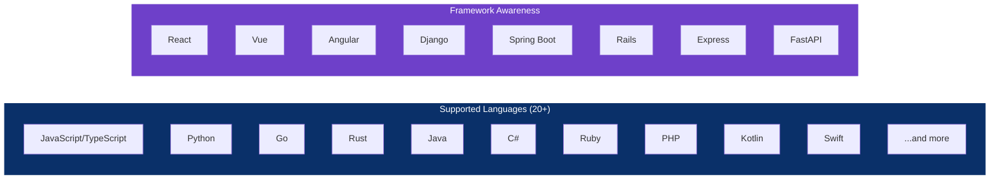

# - **Framework aware** – Understands React, Vue, An

```mermaid
graph LR
    subgraph Languages["Supported Languages (20+)"]
        JS[JavaScript/TypeScript]
        PY[Python]
        GO[Go]
        RS[Rust]
        JAVA[Java]
        CS[C#]
        RB[Ruby]
        PHP[PHP]
        KT[Kotlin]
        SW[Swift]
        More[...and more]
    end
    
    subgraph Frameworks["Framework Awareness"]
        REACT[React]
        VUE[Vue]
        ANG[Angular]
        DJ[Django]
        SPR[Spring Boot]
        RAILS[Rails]
        EXP[Express]
        FAST[FastAPI]
    end
    
    style Languages fill:#0a3069,stroke:#0a3069,stroke-width:1px,color:#fff
    style Frameworks fill:#6e40c9,stroke:#6e40c9,stroke-width:1px,color:#fff
```
