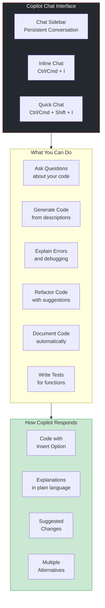

# diagram_07_copilot-chat-transforms-your-ide-from-a-code-edito-b820

```mermaid
flowchart TD
    subgraph ChatInterface["Copilot Chat Interface"]
        Sidebar[Chat Sidebar<br/>Persistent Conversation]
        Inline[Inline Chat<br/>Ctrl/Cmd + I]
        Quick[Quick Chat<br/>Ctrl/Cmd + Shift + I]
    end
    
    subgraph Capabilities["What You Can Do"]
        Ask[Ask Questions<br/>about your code]
        Generate[Generate Code<br/>from descriptions]
        Explain[Explain Errors<br/>and debugging]
        Refactor[Refactor Code<br/>with suggestions]
        Document[Document Code<br/>automatically]
        Test[Write Tests<br/>for functions]
    end
    
    subgraph Output["How Copilot Responds"]
        Code[Code with<br/>Insert Option]
        Text[Explanations<br/>in plain language]
        Diff[Suggested<br/>Changes]
        Multi[Multiple<br/>Alternatives]
    end
    
    ChatInterface --> Capabilities --> Output
    
    style ChatInterface fill:#24292f,stroke:#f78166,stroke-width:1px,color:#fff
    style Output fill:#2da44e40,stroke:#2da44e,stroke-width:1px
```
