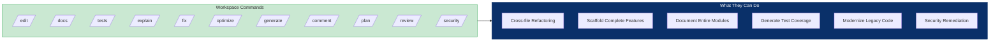

# diagram_08_security--identify-security-vulnerabilities-69bb

```mermaid
flowchart LR
    subgraph Commands["Workspace Commands"]
        direction TB
        Edit[/edit/]
        Docs[/docs/]
        Tests[/tests/]
        Explain[/explain/]
        Fix[/fix/]
        Optimize[/optimize/]
        Generate[/generate/]
        Comment[/comment/]
        Plan[/plan/]
        Review[/review/]
        Security[/security/]
    end
    
    subgraph Capabilities["What They Can Do"]
        Cross[Cross-file Refactoring]
        Scaffold[Scaffold Complete Features]
        Document[Document Entire Modules]
        Test[Generate Test Coverage]
        Modernize[Modernize Legacy Code]
        Secure[Security Remediation]
    end
    
    Commands --> Capabilities
    
    style Commands fill:#2da44e40,stroke:#2da44e,stroke-width:1px
    style Capabilities fill:#0a3069,stroke:#0a3069,stroke-width:1px,color:#fff
```
