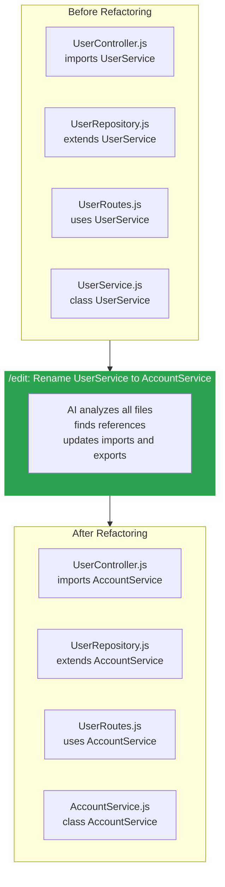

# diagram_09_use-this-to-apply-design-patterns-rename-across-f-66fb

```mermaid
flowchart TD
    subgraph Before["Before Refactoring"]
        File1[UserController.js<br/>imports UserService]
        File2[UserRepository.js<br/>extends UserService]
        File3[UserRoutes.js<br/>uses UserService]
        File4[UserService.js<br/>class UserService]
    end
    
    subgraph Command["/edit: Rename UserService to AccountService"]
        AI[AI analyzes all files<br/>finds references<br/>updates imports and exports]
    end
    
    subgraph After["After Refactoring"]
        File1A[UserController.js<br/>imports AccountService]
        File2A[UserRepository.js<br/>extends AccountService]
        File3A[UserRoutes.js<br/>uses AccountService]
        File4A[AccountService.js<br/>class AccountService]
    end
    
    Before --> Command --> After
    
    style Command fill:#2da44e,stroke:#2da44e,stroke-width:2px,color:#fff
```
