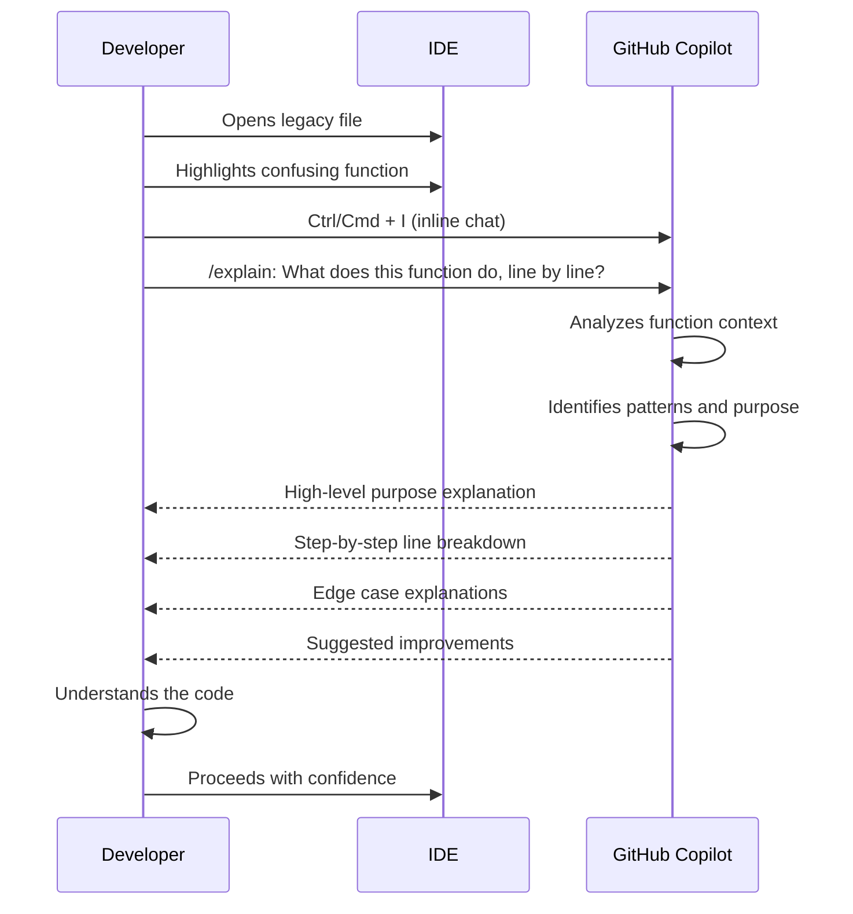

# diagram_10_ideal-for-onboarding-reviewing-prs-or-decipherin-d6c1

```mermaid
sequenceDiagram
    participant Dev as Developer
    participant IDE as IDE
    participant Copilot as GitHub Copilot
    
    Dev->>IDE: Opens legacy file
    Dev->>IDE: Highlights confusing function
    Dev->>Copilot: Ctrl/Cmd + I (inline chat)
    Dev->>Copilot: /explain: What does this function do, line by line?
    
    Copilot->>Copilot: Analyzes function context
    Copilot->>Copilot: Identifies patterns and purpose
    
    Copilot-->>Dev: High-level purpose explanation
    Copilot-->>Dev: Step-by-step line breakdown
    Copilot-->>Dev: Edge case explanations
    Copilot-->>Dev: Suggested improvements
    
    Dev->>Dev: Understands the code
    Dev->>IDE: Proceeds with confidence
```
