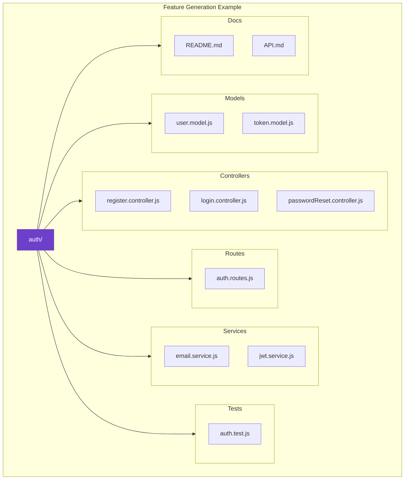

# diagram_12_transforms-legacy-jquery-dom-manipulation-into-mod-4615

```mermaid
graph TD
    subgraph Generated["Feature Generation Example"]
        Auth[auth/]
        
        subgraph Models
            User[user.model.js]
            Token[token.model.js]
        end
        
        subgraph Controllers
            Register[register.controller.js]
            Login[login.controller.js]
            Reset[passwordReset.controller.js]
        end
        
        subgraph Routes
            AuthRoutes[auth.routes.js]
        end
        
        subgraph Services
            Email[email.service.js]
            JWT[jwt.service.js]
        end
        
        subgraph Tests
            AuthTests[auth.test.js]
        end
        
        subgraph Docs
            Readme[README.md]
            API[API.md]
        end
        
        Auth --> Models
        Auth --> Controllers
        Auth --> Routes
        Auth --> Services
        Auth --> Tests
        Auth --> Docs
    end
    
    style Auth fill:#6e40c9,stroke:#6e40c9,stroke-width:2px,color:#fff
```
