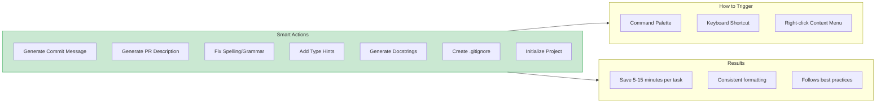

# diagram_13_initialize-project--sets-up-standard-projec-b559

```mermaid
flowchart LR
    subgraph Actions["Smart Actions"]
        Commit[Generate Commit Message]
        PR[Generate PR Description]
        Spell[Fix Spelling/Grammar]
        Types[Add Type Hints]
        Doc[Generate Docstrings]
        Gitignore[Create .gitignore]
        Init[Initialize Project]
    end
    
    subgraph Trigger["How to Trigger"]
        Command[Command Palette]
        Shortcut[Keyboard Shortcut]
        RightClick[Right-click Context Menu]
    end
    
    subgraph Result["Results"]
        Time[Save 5-15 minutes per task]
        Consistent[Consistent formatting]
        Best[Follows best practices]
    end
    
    Actions --> Trigger
    Actions --> Result
    
    style Actions fill:#2da44e40,stroke:#2da44e,stroke-width:1px
```
