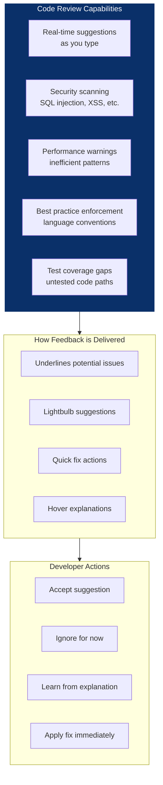

# diagram_14_test-coverage-gaps--identifies-untested-cod-7a8c

```mermaid
flowchart TD
    subgraph Review["Code Review Capabilities"]
        RealTime[Real-time suggestions<br/>as you type]
        Security[Security scanning<br/>SQL injection, XSS, etc.]
        Performance[Performance warnings<br/>inefficient patterns]
        BestPractice[Best practice enforcement<br/>language conventions]
        Coverage[Test coverage gaps<br/>untested code paths]
    end
    
    subgraph Feedback["How Feedback is Delivered"]
        Underline[Underlines potential issues]
        Lightbulb[Lightbulb suggestions]
        QuickFix[Quick fix actions]
        Hover[Hover explanations]
    end
    
    subgraph Action["Developer Actions"]
        Accept[Accept suggestion]
        Ignore[Ignore for now]
        Learn[Learn from explanation]
        Fix[Apply fix immediately]
    end
    
    Review --> Feedback --> Action
    
    style Review fill:#0a3069,stroke:#0a3069,stroke-width:1px,color:#fff
```
