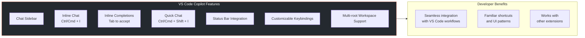

# - **Multi-root workspace support** – Works across 

```mermaid
flowchart LR
    subgraph VSCodeFeatures["VS Code Copilot Features"]
        Sidebar[Chat Sidebar]
        Inline[Inline Chat<br/>Ctrl/Cmd + I]
        Completions[Inline Completions<br/>Tab to accept]
        QuickChat[Quick Chat<br/>Ctrl/Cmd + Shift + I]
        Status[Status Bar Integration]
        Shortcuts[Customizable Keybindings]
        MultiRoot[Multi-root Workspace Support]
    end
    
    subgraph Benefits["Developer Benefits"]
        Seamless[Seamless integration<br/>with VS Code workflows]
        Familiar[Familiar shortcuts<br/>and UI patterns]
        Extensible[Works with<br/>other extensions]
    end
    
    VSCodeFeatures --> Benefits
    
    style VSCodeFeatures fill:#24292f,stroke:#f78166,stroke-width:1px,color:#fff
```
