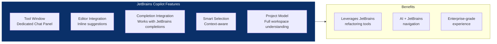

# - **Project-wide context** – Leverages JetBrains' 

```mermaid
flowchart LR
    subgraph JetBrainsFeatures["JetBrains Copilot Features"]
        ToolWindow[Tool Window<br/>Dedicated Chat Panel]
        EditorIntegration[Editor Integration<br/>Inline suggestions]
        CompletionIntegration[Completion Integration<br/>Works with JetBrains completions]
        SmartSelection[Smart Selection<br/>Context-aware]
        ProjectModel[Project Model<br/>Full workspace understanding]
    end
    
    subgraph JetBrainsBenefits["Benefits"]
        Refactoring[Leverages JetBrains<br/>refactoring tools]
        Navigation[AI + JetBrains<br/>navigation]
        Professional[Enterprise-grade<br/>experience]
    end
    
    JetBrainsFeatures --> JetBrainsBenefits
    
    style JetBrainsFeatures fill:#0a3069,stroke:#0a3069,stroke-width:1px,color:#fff
```
