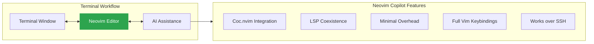

# diagram_17_remote-development--works-over-ssh-in-remot-dd12

```mermaid
flowchart LR
    subgraph NeovimFeatures["Neovim Copilot Features"]
        CocIntegration[Coc.nvim Integration]
        LSPIntegration[LSP Coexistence]
        Minimal[Minimal Overhead]
        VimKeybindings[Full Vim Keybindings]
        RemoteSSH[Works over SSH]
    end
    
    subgraph NeovimWorkflow["Terminal Workflow"]
        Terminal[Terminal Window]
        Neovim[Neovim Editor]
        Copilot[AI Assistance]
    end
    
    Terminal <--> Neovim
    Neovim <--> Copilot
    Copilot --> NeovimFeatures
    
    style Neovim fill:#2da44e,stroke:#2da44e,stroke-width:1px,color:#fff
```
