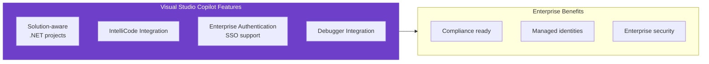

# - **Debugger integration** – Suggestions during de

```mermaid
flowchart LR
    subgraph VSFeatures["Visual Studio Copilot Features"]
        SolutionAware[Solution-aware<br/>.NET projects]
        IntelliCode[IntelliCode Integration]
        EnterpriseAuth[Enterprise Authentication<br/>SSO support]
        DebuggerIntegration[Debugger Integration]
    end
    
    subgraph Enterprise["Enterprise Benefits"]
        Compliance[Compliance ready]
        Managed[Managed identities]
        Security[Enterprise security]
    end
    
    VSFeatures --> Enterprise
    
    style VSFeatures fill:#6e40c9,stroke:#6e40c9,stroke-width:1px,color:#fff
```
