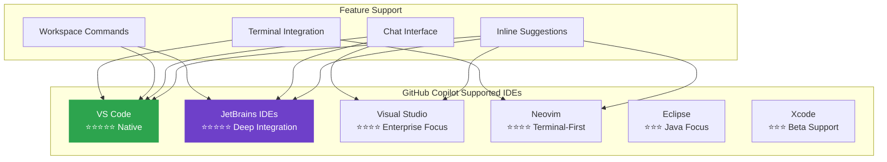

# ### Supported IDEs Overview

```mermaid
graph TD
    subgraph IDEs["GitHub Copilot Supported IDEs"]
        VSCode[VS Code<br/>⭐⭐⭐⭐⭐ Native]
        JetBrains[JetBrains IDEs<br/>⭐⭐⭐⭐⭐ Deep Integration]
        VStudio[Visual Studio<br/>⭐⭐⭐⭐ Enterprise Focus]
        Neovim[Neovim<br/>⭐⭐⭐⭐ Terminal-First]
        Eclipse[Eclipse<br/>⭐⭐⭐ Java Focus]
        Xcode[Xcode<br/>⭐⭐⭐ Beta Support]
    end
    
    subgraph Features["Feature Support"]
        Inline[Inline Suggestions] --> VSCode
        Inline --> JetBrains
        Inline --> VStudio
        Inline --> Neovim
        
        Chat[Chat Interface] --> VSCode
        Chat --> JetBrains
        Chat --> VStudio
        
        Commands[Workspace Commands] --> VSCode
        Commands --> JetBrains
        
        Terminal[Terminal Integration] --> Neovim
        Terminal --> VSCode
    end
    
    style VSCode fill:#2da44e,stroke:#2da44e,stroke-width:2px,color:#fff
    style JetBrains fill:#6e40c9,stroke:#6e40c9,stroke-width:2px,color:#fff
```
