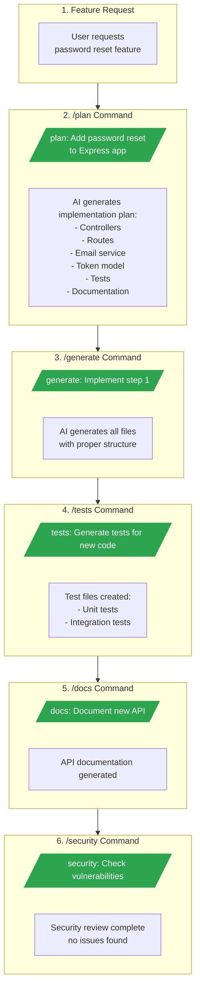

# ### Complete Workflow Example

```mermaid
flowchart TD
    subgraph Step1["1. Feature Request"]
        Request[User requests<br/>password reset feature]
    end
    
    subgraph Step2["2. /plan Command"]
        Plan[/plan: Add password reset<br/>to Express app/]
        Output[AI generates implementation plan:<br/>- Controllers<br/>- Routes<br/>- Email service<br/>- Token model<br/>- Tests<br/>- Documentation]
    end
    
    subgraph Step3["3. /generate Command"]
        Generate[/generate: Implement step 1/]
        Code[AI generates all files<br/>with proper structure]
    end
    
    subgraph Step4["4. /tests Command"]
        Tests[/tests: Generate tests for new code/]
        TestFiles[Test files created:<br/>- Unit tests<br/>- Integration tests]
    end
    
    subgraph Step5["5. /docs Command"]
        Docs[/docs: Document new API/]
        Documentation[API documentation generated]
    end
    
    subgraph Step6["6. /security Command"]
        Security[/security: Check vulnerabilities/]
        Secure[Security review complete<br/>no issues found]
    end
    
    Step1 --> Step2 --> Step3 --> Step4 --> Step5 --> Step6
    
    style Plan fill:#2da44e,stroke:#2da44e,stroke-width:1px,color:#fff
    style Generate fill:#2da44e,stroke:#2da44e,stroke-width:1px,color:#fff
    style Tests fill:#2da44e,stroke:#2da44e,stroke-width:1px,color:#fff
    style Docs fill:#2da44e,stroke:#2da44e,stroke-width:1px,color:#fff
    style Security fill:#2da44e,stroke:#2da44e,stroke-width:1px,color:#fff
```
