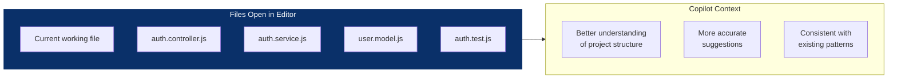

# diagram_23_copilot-considers-your-open-tabs-if-youre-workin-0738

```mermaid
flowchart LR
    subgraph Context["Files Open in Editor"]
        Current[Current working file]
        Related1[auth.controller.js]
        Related2[auth.service.js]
        Related3[user.model.js]
        Related4[auth.test.js]
    end
    
    subgraph Copilot["Copilot Context"]
        Understanding[Better understanding<br/>of project structure]
        Accuracy[More accurate<br/>suggestions]
        Consistency[Consistent with<br/>existing patterns]
    end
    
    Context --> Copilot
    
    style Context fill:#0a3069,stroke:#0a3069,stroke-width:1px,color:#fff
```
