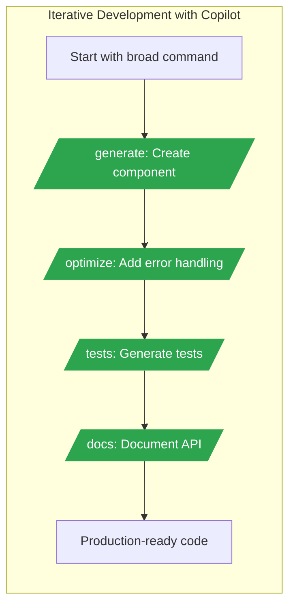

# diagram_24_3-tests-generate-tests-for-this-component-9f47

```mermaid
flowchart LR
    subgraph Iteration["Iterative Development with Copilot"]
        Start[Start with broad command]
        Generate[/generate: Create component/]
        Refine[/optimize: Add error handling/]
        Test[/tests: Generate tests/]
        Doc[/docs: Document API/]
        Done[Production-ready code]
    end
    
    Start --> Generate --> Refine --> Test --> Doc --> Done
    
    style Generate fill:#2da44e,stroke:#2da44e,stroke-width:1px,color:#fff
    style Refine fill:#2da44e,stroke:#2da44e,stroke-width:1px,color:#fff
    style Test fill:#2da44e,stroke:#2da44e,stroke-width:1px,color:#fff
    style Doc fill:#2da44e,stroke:#2da44e,stroke-width:1px,color:#fff
```
