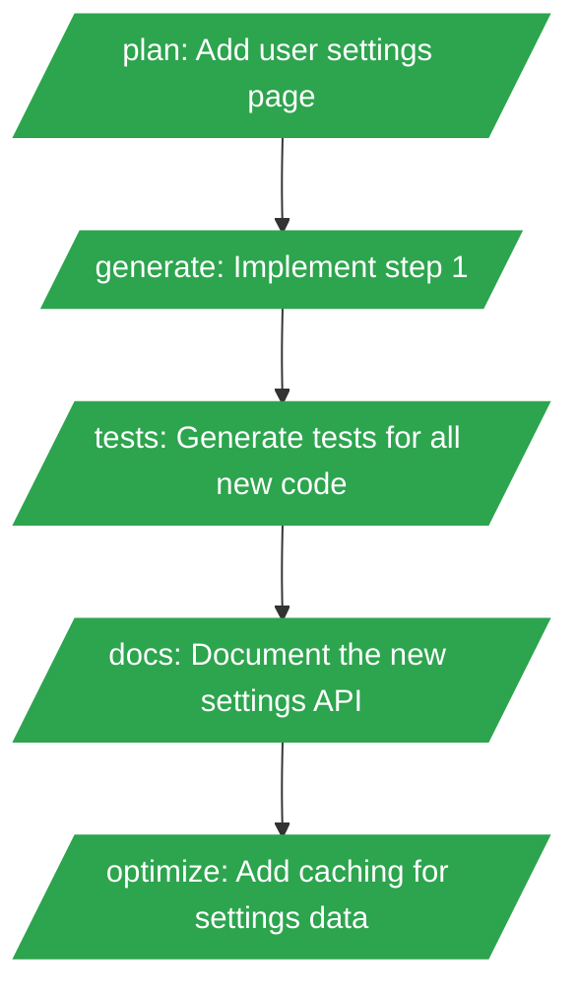

# diagram_25_chain-commands-for-comprehensive-results-40a9

```mermaid
flowchart TD
    Plan[/plan: Add user settings page/]
    Generate[/generate: Implement step 1/]
    Tests[/tests: Generate tests for all new code/]
    Docs[/docs: Document the new settings API/]
    Optimize[/optimize: Add caching for settings data/]
    
    Plan --> Generate --> Tests --> Docs --> Optimize
    
    style Plan fill:#2da44e,stroke:#2da44e,stroke-width:2px,color:#fff
    style Generate fill:#2da44e,stroke:#2da44e,stroke-width:2px,color:#fff
    style Tests fill:#2da44e,stroke:#2da44e,stroke-width:2px,color:#fff
    style Docs fill:#2da44e,stroke:#2da44e,stroke-width:2px,color:#fff
    style Optimize fill:#2da44e,stroke:#2da44e,stroke-width:2px,color:#fff
```
