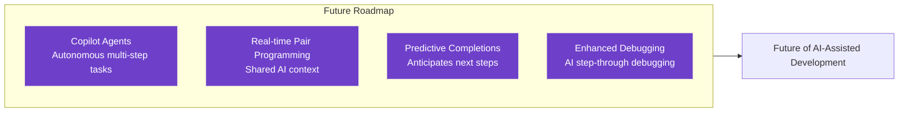

# diagram_27_coming-soon

```mermaid
flowchart LR
    subgraph Roadmap["Future Roadmap"]
        Agents[Copilot Agents<br/>Autonomous multi-step tasks]
        Pair[Real-time Pair Programming<br/>Shared AI context]
        Predictive[Predictive Completions<br/>Anticipates next steps]
        EnhancedDebug[Enhanced Debugging<br/>AI step-through debugging]
    end
    
    Roadmap --> Future[Future of AI-Assisted Development]
    
    style Agents fill:#6e40c9,stroke:#6e40c9,stroke-width:1px,color:#fff
    style Pair fill:#6e40c9,stroke:#6e40c9,stroke-width:1px,color:#fff
    style Predictive fill:#6e40c9,stroke:#6e40c9,stroke-width:1px,color:#fff
    style EnhancedDebug fill:#6e40c9,stroke:#6e40c9,stroke-width:1px,color:#fff
```
