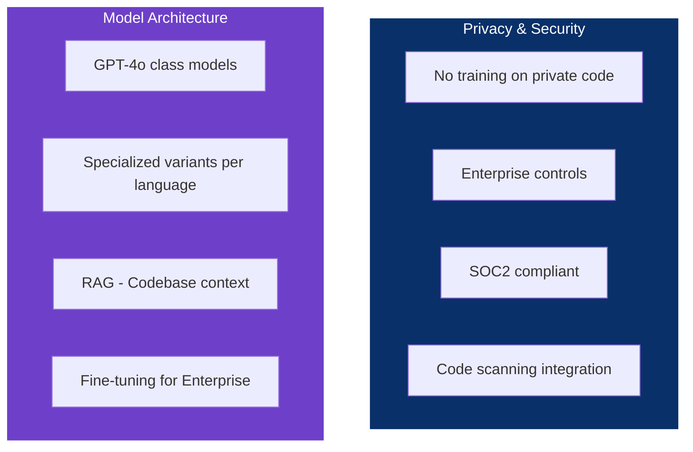

# - **Code scanning integration** – AI suggestions a

```mermaid
graph TD
    subgraph Privacy["Privacy & Security"]
        NoTrain[No training on private code]
        Enterprise[Enterprise controls]
        SOC2[SOC2 compliant]
        CodeScan[Code scanning integration]
    end
    
    subgraph Architecture["Model Architecture"]
        GPT[GPT-4o class models]
        Specialized[Specialized variants per language]
        RAG[RAG - Codebase context]
        FineTune[Fine-tuning for Enterprise]
    end
    
    style Privacy fill:#0a3069,stroke:#0a3069,stroke-width:1px,color:#fff
    style Architecture fill:#6e40c9,stroke:#6e40c9,stroke-width:1px,color:#fff
```
