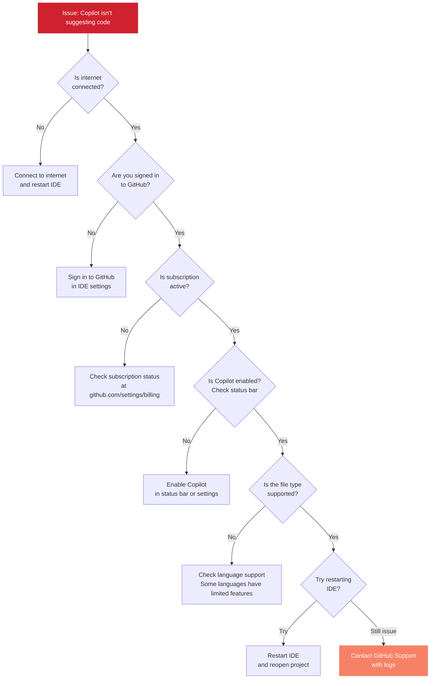

# ### Troubleshooting Flow

```mermaid
flowchart TD
    Start[Issue: Copilot isn't suggesting code]
    
    Start --> Check1{Is internet<br/>connected?}
    Check1 -->|No| Fix1[Connect to internet<br/>and restart IDE]
    Check1 -->|Yes| Check2{Are you signed in<br/>to GitHub?}
    
    Check2 -->|No| Fix2[Sign in to GitHub<br/>in IDE settings]
    Check2 -->|Yes| Check3{Is subscription<br/>active?}
    
    Check3 -->|No| Fix3[Check subscription status<br/>at github.com/settings/billing]
    Check3 -->|Yes| Check4{Is Copilot enabled?<br/>Check status bar}
    
    Check4 -->|No| Fix4[Enable Copilot<br/>in status bar or settings]
    Check4 -->|Yes| Check5{Is the file type<br/>supported?}
    
    Check5 -->|No| Fix5[Check language support<br/>Some languages have limited features]
    Check5 -->|Yes| Check6{Try restarting<br/>IDE?}
    
    Check6 -->|Try| Fix6[Restart IDE<br/>and reopen project]
    Check6 -->|Still issue| Support[Contact GitHub Support<br/>with logs]
    
    style Start fill:#cf222e,stroke:#cf222e,stroke-width:2px,color:#fff
    style Support fill:#f78166,stroke:#f78166,stroke-width:2px,color:#fff
```
