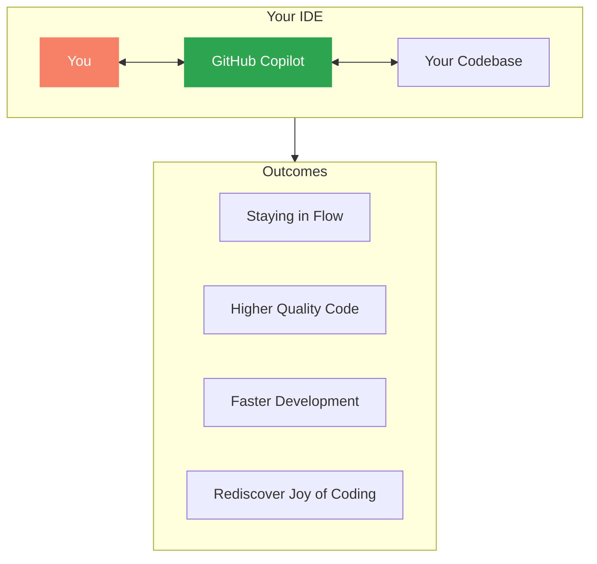

# Copilot meets you where you are, respects your pat

```mermaid
graph TD
    subgraph IDE["Your IDE"]
        You[You]
        Copilot[GitHub Copilot]
        Code[Your Codebase]
    end
    
    You <--> Copilot
    Copilot <--> Code
    
    subgraph Outcomes["Outcomes"]
        Flow[Staying in Flow]
        Quality[Higher Quality Code]
        Speed[Faster Development]
        Joy[Rediscover Joy of Coding]
    end
    
    IDE --> Outcomes
    
    style Copilot fill:#2da44e,stroke:#2da44e,stroke-width:2px,color:#fff
    style You fill:#f78166,stroke:#f78166,stroke-width:2px,color:#fff
```
