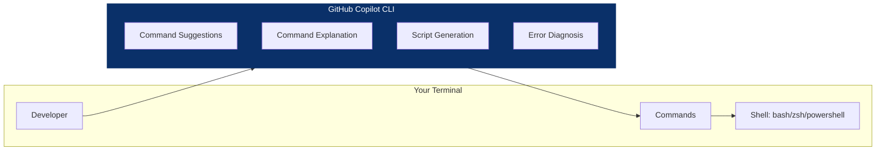

# diagram_02_github-copilot-is-now-bringing-ai-to-the-terminal-c637

```mermaid
flowchart LR
    subgraph Terminal["Your Terminal"]
        Shell[Shell: bash/zsh/powershell]
        User[Developer]
        Commands[Commands]
    end
    
    subgraph Copilot["GitHub Copilot CLI"]
        Suggest[Command Suggestions]
        Explain[Command Explanation]
        Generate[Script Generation]
        Diagnose[Error Diagnosis]
    end
    
    User --> Copilot
    Copilot --> Commands
    Commands --> Shell
    
    style Copilot fill:#0a3069,stroke:#0a3069,stroke-width:2px,color:#fff
```
