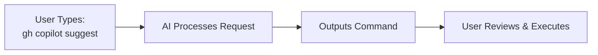

# diagram_04_basic-usage

```mermaid
flowchart LR
    User[User Types:<br/>gh copilot suggest]
    AI[AI Processes Request]
    Output[Outputs Command]
    Execute[User Reviews & Executes]
    
    User --> AI --> Output --> Execute
```
