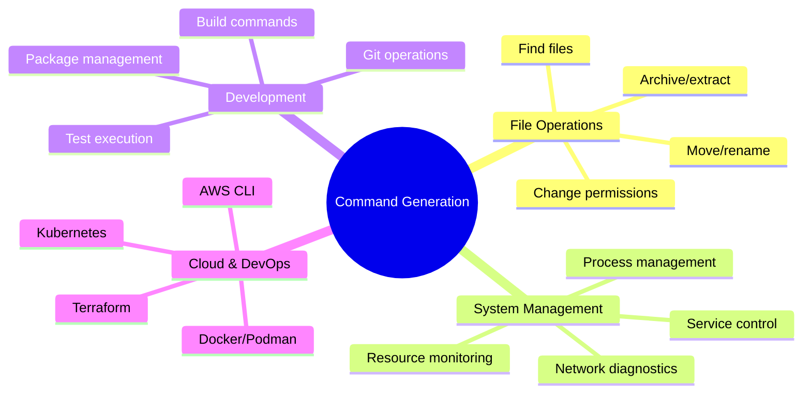

# diagram_05_basic-command-generation

```mermaid
mindmap
  root((Command Generation))
    File Operations
      Find files
      Move/rename
      Change permissions
      Archive/extract
    System Management
      Process management
      Service control
      Resource monitoring
      Network diagnostics
    Development
      Git operations
      Build commands
      Test execution
      Package management
    Cloud & DevOps
      Docker/Podman
      Kubernetes
      AWS CLI
      Terraform
```
